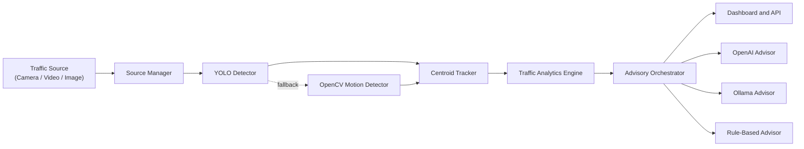
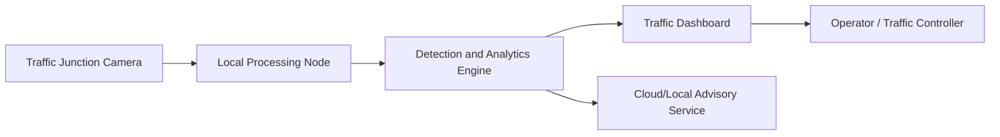
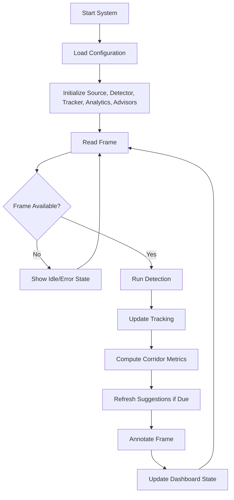

# Smart Traffic Management System for Urban Congestion — Master Document

> **Deduplicated master document.** All repeating content has been merged into its best source.
> Generated: Saturday, 05 April 2026
>
> **Structure:**
> 1. Quick-Start & Operational Guide *(from README)*
> 2. Full Project Report *(from PROJECT_REPORT_DETAILED.md — the single authoritative source)*
> 3. Formula & Algorithm Reference *(from formula.md — technical deep-dive)*
>
> **Removed as fully superseded:**
> - `PROJECT_REPORT_DRAFT.md` — every section exists in fuller form in the Detailed Report
> - `README` Implementation Formulas section — covered in depth by formula.md
> - `README` project background paragraphs — covered by Ch.1 of the Detailed Report

---

---

# Part 1 — Quick-Start and Operational Guide

> *Source: README.md — operational and setup information only.
> The introduction and background paragraphs are covered fully in Chapter 1 of Part 2.*

## Project Structure

- `Simulation/simulation1.html`: original self-contained traffic simulation and dashboard
- `Simulation/traffic-analytics.html`: original standalone live graph dashboard for timeline analytics
- `traffic_ai/config.py`: environment and runtime configuration
- `traffic_ai/services/source_manager.py`: camera, image, and video ingestion
- `traffic_ai/vision/detector.py`: YOLO detector plus OpenCV motion fallback
- `traffic_ai/vision/tracker.py`: lightweight centroid tracking
- `traffic_ai/services/analytics.py`: corridor pressure, congestion, throughput, and controller-note generation
- `traffic_ai/services/advisors.py`: OpenAI, Ollama, and offline advisory chain
- `traffic_ai/services/processor.py`: main live processing loop
- `traffic_ai/web/app.py`: Flask dashboard server and API routes
- `traffic_ai/web/templates/dashboard.html`: existing lightweight HTML dashboard UI
- `traffic_ai/web/templates/control_center.html`: new analysis-to-simulation operator site
- `traffic_ai/web/static/`: dashboard JavaScript and CSS
- `run_traffic_ai.py`: Python bootstrap launcher
- `launch_traffic_ai.ps1`: Windows launcher that can install missing software

## Running The HTML Prototype

Open `Simulation/simulation1.html` in a modern browser.

To view graphs over time, open `Simulation/traffic-analytics.html` in the same browser while the simulation is running. The graph page reads the live analytics feed every second, can load permanently stored sessions from browser storage, and can also import exported JSON logs.

## Running The Python Traffic AI System

### Fastest Windows Start

From PowerShell:

```powershell
.\launch_traffic_ai.ps1
```

Examples:

```powershell
.\launch_traffic_ai.ps1 -SourceType camera -SourceValue 0
.\launch_traffic_ai.ps1 -SourceType video -SourceValue "D:\traffic\junction.mp4"
.\launch_traffic_ai.ps1 -SourceType image -SourceValue "D:\traffic\frame.jpg"
.\launch_traffic_ai.ps1 -InstallSystemTools
```

The PowerShell launcher will:

- try to find Python
- install Python with `winget` if it is missing
- optionally install FFmpeg when `-InstallSystemTools` is used
- start the Python dashboard launcher

### Python Launch

If Python is already installed:

```powershell
python .\run_traffic_ai.py --source-type camera --source-value 0
```

Model selection examples:

```powershell
python .\run_traffic_ai.py --model-family auto --model-priority balanced
python .\run_traffic_ai.py --model-family yolo26 --model-priority quality
python .\run_traffic_ai.py --vision-model .\yolo26m.pt --show-config
```

The launcher now profiles CPU, RAM, and GPU capability and auto-picks a detector family and size for the system. Auto mode prioritizes YOLO26, then uses family defaults when local weights are not available, and finally falls back across safe detector candidates before switching to OpenCV motion detection.

The bootstrap script installs any missing Python packages from `requirements.txt` before starting Flask.

After launch, open either site in your browser:

```text
http://127.0.0.1:8501/control-center
http://127.0.0.1:8501/dashboard
```

The new control-center site lets you:

- watch the live annotated traffic stream
- present four separate `North`, `South`, `East`, and `West` feeds at the top of the page
- assign each direction manually using:
- camera indexes like `0`, `1`, `2`, `3`
- uploaded video clips
- uploaded images
- local file paths
- live stream URLs such as RTSP or HTTP camera feeds
- avoid automatic startup of a default camera feed
- run analysis only from the four manually assigned directional feeds when `Directional Feeds Only` is enabled
- switch camera, image, and video sources
- upload traffic media directly from the browser
- monitor corridor pressure, congestion, throughput, and mobility
- view live AI suggestions and offline fallback alerts
- adjust the corridor split dynamically when the automatic division feels wrong
- push analysis results into a digital-twin simulation stage without touching the original HTML simulation
- manually clear directional screens, set directional priority, and pause the digital twin while analysis keeps running

## OpenAI And Offline Mode

The AI advisory chain runs in this order:

1. OpenAI
2. Ollama if configured
3. Offline rule-based traffic advisor

This means the dashboard keeps working even during internet or API failures. The vision pipeline also stays local after the detector weights are available.

Create a `.env` file from `.env.example` if you want to set your OpenAI key or adjust models:

```powershell
Copy-Item .env.example .env
```

Important environment variables:

- `OPENAI_API_KEY`: required for cloud suggestions
- `OPENAI_MODEL`: default is `gpt-4o-mini`
- `OLLAMA_ENABLED`: set to `true` to use a local LLM fallback
- `VISION_MODEL_PATH`: default is `yolov8n.pt`, but you can replace it with a custom Indian-traffic model
- `MODEL_FAMILY`: optional launch argument for selecting detector family (for example `yolo26`, `rtdetr`, `yolo-world`, `yoloe`)
- `MODEL_PRIORITY`: optional launch argument for `quality`, `balanced`, or `speed`

Note: SAM, SAM2, SAM3, MobileSAM, and FastSAM are segmentation families and are intentionally not auto-selected for this traffic pipeline because it is optimized for box-based detection and tracking.

## Notes On Indian Traffic Scenes

The current analytics layer is tuned for mixed urban traffic and gives special weight to:

- two-wheelers
- buses and trucks
- pedestrian spillover
- corridor crowding and low movement

For higher-quality recognition of Indian-specific categories such as auto-rickshaws, replace `VISION_MODEL_PATH` with a custom fine-tuned YOLO model trained on Indian-road datasets.

## Capstone Extension Ideas

- Custom-trained detection weights for auto-rickshaws, tractors, lane violations, and helmet compliance
- Multi-junction coordination with shared analytics
- Emergency vehicle route prioritization across multiple corridors
- Long-term reporting dashboards and incident replay
- Integration with municipal sensors, edge devices, or mobile operator tools


---

# Part 2 — Full Project Report

> *Source: PROJECT_REPORT_DETAILED.md — the complete, section-by-section academic report.
> This is the single authoritative version. The earlier draft has been retired.*

## Title Page

**Project Title**  
Smart Traffic Management System for Urban Congestion

**Submitted by**  
[TO BE FILLED MANUALLY: Student 1 Name and ID]  
[TO BE FILLED MANUALLY: Student 2 Name and ID]  
[TO BE FILLED MANUALLY: Student 3 Name and ID]

**Under the guidance of**  
[TO BE FILLED MANUALLY: Guide Name and Designation]

**Programme / Department / University**  
[TO BE FILLED MANUALLY exactly as required by the department]

**Month and Year**  
[TO BE FILLED MANUALLY]

## Bonafide Certificate

[TO BE FILLED MANUALLY using the official wording from the department template]

## Declaration

[TO BE FILLED MANUALLY using the official wording from the department template]

## Acknowledgement

We express our sincere gratitude to our project guide for the continuous support, technical guidance, and encouragement provided throughout the development of this project. The suggestions received during the design, implementation, and documentation phases helped us improve both the quality of the system and the clarity of our work.

We also thank the faculty members and the Department of Computer Science and Engineering for giving us the opportunity to undertake this project and for providing the academic environment necessary to complete it successfully. Their support helped us approach the problem in a structured and practical manner.

We extend our gratitude to Presidency University for providing the resources and learning environment required for research, experimentation, and project development. We are also thankful to our friends and classmates for their discussions, suggestions, and assistance during testing and review.

Finally, we acknowledge the contribution of the open-source developer community. Libraries and tools such as Python, Flask, OpenCV, Ultralytics YOLO, and supporting packages played a major role in enabling the implementation of this project.

### Acknowledgement Expansion Option

If your department accepts a longer acknowledgement page, you can further personalize it by thanking:

1. project review committee members,
2. laboratory staff or coordinators,
3. classmates who provided testing support,
4. family members for encouragement,
5. anyone who helped with field footage or demonstration logistics.

## Abstract

Traffic congestion has become a major issue in urban environments because of rapid growth in the number of vehicles, poor lane discipline in mixed traffic, increasing pedestrian movement, and the inability of traditional traffic control systems to adapt dynamically to changing conditions. Fixed-time traffic control methods often operate without awareness of actual road demand, causing excessive delay, queue buildup, fuel wastage, and environmental impact. These limitations create a strong need for systems that can observe real traffic conditions and provide timely support for traffic management.

This project presents a Smart Traffic Management System for Urban Congestion that combines computer vision, live traffic analytics, and AI-assisted recommendations into a unified software platform. The system accepts traffic input from a live camera, recorded video, or image source. It then applies a YOLO-based object detection model to identify road users such as cars, motorcycles, buses, trucks, bicycles, pedestrians, and similar classes found in urban traffic scenes. When the primary detector is unavailable, the system automatically falls back to an OpenCV-based motion detection method to preserve core functionality.

After detection, a tracking and analytics pipeline estimates movement and groups activity into four directional corridors of an intersection. The system computes corridor pressure, vehicle count, heavy vehicle concentration, two-wheeler density, pedestrian activity, mobility score, throughput, and an overall congestion index. These metrics are then passed to an advisory layer that generates traffic management suggestions. The advisory system can operate through OpenAI, a local Ollama model, or offline rule-based logic, depending on availability.

The final output is delivered through a Flask-based dashboard that streams annotated video and displays live traffic status, alerts, and recommendations. The developed prototype shows that software-driven traffic intelligence can support adaptive monitoring and operational awareness while remaining modular, fault-tolerant, and scalable for future enhancement.

## List of Figures

[TO BE FILLED MANUALLY after you insert figures in the Word document]

Suggested figures:
1. SDG mapping for the project
2. Overall system architecture
3. Workflow of the traffic pipeline
4. Dashboard interface
5. Detection output frame
6. Corridor analytics view
7. Test result or comparison chart

### Suggested Expanded List of Figures

If you want the final document to become much larger and more complete, use more figures across chapters. A strong project report can naturally contain 15 to 25 figures. Suggested additions are:

1. Figure 1.1 SDG relevance of the project
2. Figure 3.1 Methodology overview
3. Figure 5.1 Block diagram of the proposed system
4. Figure 5.2 System flow chart
5. Figure 5.3 Communication model view
6. Figure 6.1 Simulation interface
7. Figure 6.2 Dashboard home screen
8. Figure 6.3 Sample detected traffic frame
9. Figure 6.4 Upload workflow
10. Figure 7.1 Startup test evidence
11. Figure 7.2 Video-mode test evidence
12. Figure 7.3 Advisory fallback evidence
13. Figure 7.4 Sample analytics timeline
14. Figure A.1 Appendix screenshot of project structure
15. Figure A.2 Appendix screenshot of additional test output

## List of Tables

[TO BE FILLED MANUALLY after you insert tables in the Word document]

Suggested tables:
1. Project objectives
2. Literature survey comparison
3. Functional requirements
4. Non-functional requirements
5. Risk analysis
6. Software tools used
7. Test plan
8. Test results

### Suggested Expanded List of Tables

To naturally increase document depth, include more structured tables. Suggested additions are:

1. Table 1.1 Motivation statistics
2. Table 1.2 Objective-to-outcome mapping
3. Table 2.1 Literature review comparison
4. Table 3.1 Metric interpretation table
5. Table 4.1 Phase-wise project timeline
6. Table 4.2 Risk matrix
7. Table 4.3 Estimated project budget
8. Table 5.1 Functional requirements
9. Table 5.2 Non-functional requirements
10. Table 5.3 Requirement traceability matrix
11. Table 5.4 API communication model
12. Table 6.1 Hardware configuration
13. Table 6.2 Software tools and libraries
14. Table 6.3 Major source-code modules
15. Table 7.1 Detailed test plan
16. Table 7.2 Test results summary
17. Table 7.3 Comparative insight table
18. Table 8.1 Social benefits and risks
19. Table A.1 Appendix evidence index

## Abbreviations

AI - Artificial Intelligence  
API - Application Programming Interface  
CV - Computer Vision  
FPS - Frames Per Second  
HTTP - Hypertext Transfer Protocol  
IoT - Internet of Things  
LLM - Large Language Model  
MOG2 - Mixture of Gaussians background subtraction  
SDG - Sustainable Development Goal  
UI - User Interface  
YOLO - You Only Look Once

Additional abbreviations you may include if you use them in the final report:

CPU - Central Processing Unit  
GPU - Graphics Processing Unit  
JSON - JavaScript Object Notation  
MJPEG - Motion JPEG  
RAM - Random Access Memory

# Chapter 1 Introduction

## 1.1 Background

Urban transportation networks are under constant pressure due to increasing population density, expansion of private vehicle ownership, and the growth of commercial and public mobility demand. One of the major consequences of this growth is traffic congestion, especially at intersections where different traffic streams interact and compete for limited right-of-way. Congestion leads to increased travel time, unpredictability in commute schedules, wasted fuel, higher emissions, driver frustration, and reduced road safety.

Traditional traffic systems often rely on fixed-time signaling or manual intervention. These approaches do not adapt efficiently to real traffic conditions. During peak hours, one corridor may experience severe queue buildup while another remains lightly loaded, but a fixed timing cycle treats both similarly. This mismatch reduces traffic flow efficiency and creates unnecessary waiting.

Recent developments in computer vision, machine learning, and intelligent transportation systems have created new possibilities for observing traffic in real time. Cameras are already widely available in urban spaces, and when combined with detection and analytics models, they can provide rich situational awareness without requiring expensive embedded road infrastructure. A vision-driven traffic management system can detect vehicles and pedestrians, understand directional pressure, estimate congestion, and support more informed operational decisions.

This project addresses that opportunity by developing a smart traffic management prototype that performs live traffic observation, congestion analysis, and recommendation generation through a dashboard-based software platform.

### 1.1.1 Urban Congestion as a Systems Problem

Traffic congestion should not be seen as only a road-capacity problem. It is a systems problem involving infrastructure, human behavior, vehicle mix, pedestrian movement, road design, peak-hour demand, and traffic-control policy. In urban Indian conditions, this problem becomes more complex because road use is not always lane-disciplined and different vehicle classes share the same road space in highly dynamic ways.

From a systems perspective, congestion emerges when:

1. road demand exceeds effective road capacity,
2. turning conflicts increase at junctions,
3. pedestrian spillover disrupts vehicle movement,
4. two-wheelers and heavy vehicles behave differently in the same intersection space,
5. traffic control logic remains static while traffic conditions remain dynamic.

This project is based on the idea that better observation leads to better management. If a system can continuously sense traffic conditions visually and convert those observations into understandable metrics, the quality of operator decision-making can improve.

### 1.1.2 Need for Real-Time Observation

Most traffic problems worsen because response comes too late. A queue that is manageable in its early stage can become a severe intersection blockage if it is not recognized quickly. Real-time observation therefore becomes central to any smart traffic system.

The need for real-time traffic observation can be summarized as follows:

| Problem in Conventional Systems | Need for Real-Time Observation |
|---|---|
| Fixed timing ignores actual traffic load | Detect changing corridor demand dynamically |
| Manual monitoring is limited and inconsistent | Provide continuous automated scene awareness |
| Congestion becomes visible only after escalation | Identify buildup early through metrics |
| Mixed traffic complexity is hard to judge visually | Convert scene conditions into structured indicators |
| Field operators may not have analytic support | Provide short actionable suggestions |

## 1.2 Statistics of Project

Rapid urbanization and increasing vehicle ownership have significantly increased traffic congestion in Indian cities. This trend is visible both at the national scale and at the city level. According to the Ministry of Road Transport and Highways Annual Report 2024-25, the road transport sector remains one of the largest and fastest growing transport segments in India, and registered vehicle volumes continue to place pressure on urban mobility systems (MoRTH, 2025). At the city level, Bengaluru remains one of the clearest examples of congestion stress.

The TomTom Traffic Index for Bengaluru reports that in 2025 the city recorded an average congestion level of 74.4%, a 10 km trip took 36 minutes and 9 seconds on average, and rush-hour speed fell to 13.9 km/h (TomTom, 2026). These values show that congestion is not only frequent but severe enough to affect daily travel reliability and system efficiency.

The same traffic index also reports that commuters in Bengaluru lost a substantial amount of productive time because of recurring traffic delays. This reflects the broader urban cost of congestion, which includes:

1. loss of time,
2. higher fuel consumption,
3. reduced productivity,
4. increased driver stress,
5. increased emissions due to idling and stop-and-go movement.

The importance of this project can therefore be justified through the following observations:

| Indicator | Observation | Relevance to Project |
|---|---|---|
| Urban congestion severity | Bengaluru ranked among the most congested cities globally in the 2025 TomTom index | Shows need for real-time congestion understanding |
| Travel time burden | Average 10 km trip required over 36 minutes | Motivates adaptive traffic assistance |
| Rush-hour speed | Average rush-hour speed dropped to 13.9 km/h | Indicates inefficient road usage under peak load |
| Vehicle growth pressure | National registered motor vehicles continue to grow according to MoRTH reporting | Supports the need for scalable traffic intelligence |
| Sustainability concern | Congestion increases fuel waste and emissions | Links project to SDG and sustainability goals |

These statistics provide strong motivation for the development of a traffic management system that can observe road conditions continuously, interpret congestion using live visual input, and present actionable support for traffic operators.

## 1.3 Prior Existing Technologies

Before proposing an improved solution, it is important to understand the technologies already used in traffic control and congestion management.

The first major category consists of fixed-time traffic signal systems. These systems assign pre-configured signal durations based on average expected traffic conditions. They are simple to deploy and operate, but they do not respond well to sudden changes in traffic density, accidents, or peak-hour imbalance between approaches.

The second category includes sensor-based adaptive systems that use loop detectors, infrared sensors, pressure sensors, or embedded road hardware. Such systems can provide traffic measurements, but they usually involve installation cost, road modification, maintenance complexity, and physical wear over time.

The third category is simulation-based traffic analysis. Simulation environments are useful for understanding traffic behavior, validating signal logic, and testing planning strategies. However, many simulations do not process real-world footage and therefore may not reflect actual field conditions unless carefully calibrated.

The fourth category is vision-based monitoring. Camera-driven systems can estimate vehicle count, lane occupancy, violations, and traffic density. Their advantage is that a single visual source can capture several lanes and road-user categories without physical intrusion into the road surface. However, many existing systems focus only on detection accuracy and do not convert observations into operator-friendly traffic guidance.

This project builds on the strengths of vision-based monitoring while addressing gaps in modularity, fallback support, and traffic recommendation generation.

## 1.4 Proposed Approach

The proposed approach is to build a modular software platform that can observe traffic, interpret congestion patterns, and provide actionable guidance through a live interface.

The system begins by accepting a source in one of three forms: camera feed, recorded video, or image input. A source manager standardizes the acquisition process so that the later modules can work with a consistent frame stream regardless of input type.

Next, the system performs object detection using a YOLO-based model. The model identifies common traffic entities such as cars, buses, trucks, motorcycles, bicycles, and pedestrians. To improve resilience, the system includes a fallback motion-based detector using OpenCV, which allows traffic awareness to continue even if the main model is unavailable.

The detections are then passed through a centroid-based tracking mechanism. Tracking improves temporal understanding by linking the same object across frames and enabling movement estimation. After this, the analytics engine divides the traffic scene into four conceptual corridors: north, east, south, and west. For each corridor, it computes weighted traffic load, movement quality, heavy vehicle concentration, two-wheeler density, and pedestrian presence.

Based on these analytics, the system derives an overall congestion index and identifies the corridor with the highest operational pressure. An advisory layer then uses either OpenAI, Ollama, or offline traffic rules to generate short suggestions that can guide operators toward better management decisions.

Finally, all outputs are presented through a dashboard that provides annotated video, live metrics, alerts, and recommendations.

### 1.4.1 Why This Approach Was Chosen

The approach used in this project was selected because it balances practicality, modularity, and demonstrability. Instead of building a purely theoretical model or a hardware-heavy system, the project uses software components that can run on common computing hardware. This makes the prototype easier to build, test, and explain in an academic setting.

The approach was also chosen because:

1. camera/video input is easier to obtain than embedded road instrumentation,
2. computer vision supports multi-object observation in one frame,
3. a dashboard makes the output understandable for demonstration and evaluation,
4. fallback logic improves robustness and reflects real deployment realities,
5. modular design makes future expansion easier.

### 1.4.2 Scope of the Present Work

The present project focuses on congestion observation and decision support rather than direct autonomous control of traffic signals. That means the system is designed to:

1. observe traffic,
2. detect and track vehicles and pedestrians,
3. estimate traffic intensity direction-wise,
4. generate suggestions,
5. present findings through a dashboard.

The project does not currently:

1. directly control live municipal signal hardware,
2. implement full multi-junction coordination,
3. provide legal-grade surveillance logging,
4. claim production-grade field validation across many real intersections.

This scope definition is important because it clarifies that the project is a strong prototype and research demonstration platform.

## 1.5 Objectives

The main objectives of the project are listed below:

1. To develop a traffic monitoring system that supports camera, image, and video input sources.
2. To detect mixed urban traffic entities such as cars, motorcycles, buses, trucks, bicycles, pedestrians, and related road users.
3. To track traffic objects and estimate directional movement patterns.
4. To compute corridor-level congestion measures such as pressure, mobility, throughput, and congestion index.
5. To provide operator-friendly traffic guidance through an advisory system.
6. To build a real-time dashboard for traffic visualization, alerts, and analytics.
7. To ensure system continuity through fallback mechanisms when cloud services or detectors are unavailable.

### 1.5.1 Objective-to-Outcome Mapping

| Objective | Expected Outcome in the Prototype |
|---|---|
| Multi-source traffic input | Camera, image, and video source handling |
| Mixed-traffic detection | Bounding boxes and class labels on road users |
| Movement understanding | Object tracking and motion continuity |
| Congestion estimation | Corridor pressure, mobility, throughput, congestion index |
| Operator support | Suggestions, controller notes, and alerts |
| Visualization | Dashboard with annotated feed and state metrics |
| Resilience | Detector and advisor fallback logic |

### 1.5.2 Academic Contribution of the Objectives

The objectives are not only implementation goals; they also give the project academic structure. Each objective links to a measurable system feature and can be evaluated through testing. This makes the final report easier to defend because the implementation can be matched directly against the intended aims.

## 1.6 SDGs

The project supports multiple Sustainable Development Goals.

**SDG 9: Industry, Innovation and Infrastructure**  
The project contributes to smart infrastructure by using digital intelligence to improve how traffic information is collected and acted upon.

**SDG 11: Sustainable Cities and Communities**  
Reducing congestion and enabling more efficient road usage can contribute to safer, more sustainable, and better-managed urban transportation systems.

**SDG 3: Good Health and Well-being**  
Efficient traffic flow can reduce stress, travel uncertainty, accident risk, and exposure to pollution caused by long periods of idling.

**SDG 13: Climate Action**  
Congestion contributes to emissions and fuel waste. A smarter traffic management approach may indirectly reduce idle time and lower transport-related environmental impact.

## 1.7 Overview of Project Report

This report is organized into nine chapters. Chapter 1 introduces the problem, motivation, existing approaches, objectives, SDG relevance, and the proposed method. Chapter 2 presents the literature review and identifies the gap that motivates the project. Chapter 3 describes the methodology and development approach used to build the system. Chapter 4 discusses project management aspects such as timeline, risks, and budget. Chapter 5 explains the system analysis and design, including requirements and architecture. Chapter 6 covers the hardware, software, and simulation components used in implementation. Chapter 7 presents evaluation, testing, results, and insights. Chapter 8 discusses social, legal, ethical, sustainability, and safety aspects. Chapter 9 concludes the report and suggests future improvements.

### 1.7.1 Chapter 1 Summary

This chapter established the real-world relevance of traffic congestion, described the motivation behind smart traffic observation, and positioned the proposed project as a practical, modular, vision-driven congestion management prototype.

# Chapter 2 Literature Review

## 2.1 Introduction to Literature Review

The purpose of the literature review is to study existing research and practical systems related to intelligent traffic monitoring, traffic signal optimization, vision-based vehicle detection, congestion analytics, and AI-assisted transportation systems. Reviewing prior work helps identify what has already been achieved, what limitations remain, and how the present project can be meaningfully positioned.

## 2.2 Vision-Based Traffic Monitoring

Many recent traffic systems use cameras because they provide rich visual information compared to single-purpose sensors. Vision-based systems can detect vehicles, estimate density, monitor flow, and identify abnormal events such as queue buildup or lane blocking. This approach is particularly attractive for urban environments because one camera can capture several lanes and road-user categories simultaneously.

However, the performance of these systems depends on image quality, lighting, weather conditions, camera angle, and robustness of the detection model. Some systems perform well in controlled datasets but are harder to generalize to mixed traffic conditions.

## 2.3 YOLO-Based Detection in Transportation

The YOLO family of models is widely used in transport-related object detection because it offers a good balance between speed and detection quality. YOLO models can detect multiple objects in a single pass, making them suitable for near real-time applications such as surveillance, traffic counting, and intersection monitoring.

Despite these advantages, generic YOLO models may not always capture region-specific classes effectively. For example, local mixed traffic environments may include auto-rickshaws, overloaded two-wheelers, non-lane-based movement, and roadside pedestrian spillover. These limitations motivate the need for contextual analytics or custom training in future improvements.

## 2.4 Intelligent Traffic Control and Analytics

Intelligent traffic control research often focuses on adaptive signaling, queue estimation, route prediction, and pressure-based control. Many studies show that real-time traffic measurements can improve intersection performance when compared to fixed-time signaling. Approaches differ in the sensing methods used, such as loop detectors, simulations, camera feeds, and connected vehicle data.

While several works address optimization or prediction, fewer systems connect analytics directly to an operator dashboard with understandable explanations or fallback behavior. In practice, decision support is useful only when the system remains usable despite missing detectors, incomplete connectivity, or changing source types.

## 2.4.1 Summary of Literature Themes

The reviewed research can be grouped into four themes:

1. **Detection-centric studies**  
   These focus on improving object recognition accuracy in traffic scenes.
2. **Prediction-centric studies**  
   These focus on forecasting congestion, speed, or traffic flow.
3. **Control-centric studies**  
   These focus on optimizing signal timing or traffic operations.
4. **System-integration studies**  
   These combine sensing, analysis, and decision support, but are comparatively fewer.

This project belongs mainly to the fourth category because it tries to integrate sensing, analytics, and actionable presentation.

## 2.5 Research Gap

The literature suggests three major gaps relevant to this project.

1. Many systems focus mainly on object detection accuracy and do not present congestion metrics in an operationally useful dashboard format.
2. Some systems depend on dedicated hardware or infrastructure-heavy sensing, which may not be ideal for low-cost prototyping.
3. Very few modular prototypes combine live or recorded visual inputs, corridor-level congestion analytics, online and offline advisory support, and dashboard-based presentation in one integrated platform.

## 2.6 Positioning of the Present Project

The present project is positioned as a software-centric, modular traffic management prototype that combines mixed-traffic visual detection, corridor analytics, AI-assisted traffic suggestions, and resilient fallback behavior. Instead of limiting the system to vehicle counting or simulation, the project emphasizes practical observability and continuity. This makes it suitable for demonstration, academic exploration, and future extension toward more advanced intelligent transportation systems.

## 2.7 What You Still Need to Add

The chapter already has a strong base, but in a final university submission you should still refine the literature review by aligning the chosen papers with the exact project angle. The comparison below can be included directly in the report and then improved further if your guide wants additional papers.

### 2.7.1 Literature Comparison Table

| Ref. No. | Paper | Year | Core Focus | Main Contribution | Limitation Relevant to This Project |
|---|---|---|---|---|---|
| [L1] | Abdelhalim and Zhao, *Computer vision for transit travel time prediction* | 2024/2025 | Roadside imagery and transport analytics | Shows that roadside computer vision can support transport performance estimation | Focused on travel time prediction rather than operator-facing congestion control |
| [L2] | Wang et al., *Enhanced Multi-Target Detection in Complex Traffic Using an Improved YOLOv8* | 2024 | Traffic object detection | Improves YOLOv8 detection quality in complex traffic scenes | Detection-focused; does not provide congestion dashboarding or fallback logic |
| [L3] | Yu et al., *Real-Time Monitoring Method for Traffic Surveillance Scenarios Based on Enhanced YOLOv7* | 2024 | Real-time monitoring | Demonstrates improved traffic surveillance performance with enhanced YOLO | Emphasis is mainly on monitoring accuracy rather than full traffic management workflow |
| [L4] | Soleimani et al., *Fusion of deep belief network and SVM regression for intelligence of urban traffic control system* | 2024 | Intelligent traffic control | Shows predictive control value in intelligent traffic systems | Relies on prediction/control modeling rather than live visual analytics pipeline |
| [L5] | Reddy et al., *A deep learning-based smart service model for context-aware intelligent transportation system* | 2024 | ITS services | Explores broader deep-learning ITS architecture | Broader ITS framing, less focused on live congestion visualization |
| [L6] | STTF: *An Efficient Transformer Model for Traffic Congestion Prediction* | 2023 | Congestion prediction | Highlights importance of spatio-temporal traffic modeling | Predictive emphasis rather than visual live intersection intelligence |
| [L7] | García-based comparative YOLO traffic studies such as *Intelligent Traffic Management: Comparative Evaluation of YOLOv3, YOLOv5, and YOLOv8* | 2025 | Detection model comparison | Useful for understanding model trade-offs in urban detection | Model comparison alone does not provide full advisory or dashboard integration |

### 2.7.2 Analytical Discussion

The reviewed literature indicates that recent research has become increasingly effective at solving narrow technical sub-problems such as vehicle detection, traffic prediction, travel-time estimation, or adaptive control. However, many published systems are optimized around one core goal and not necessarily around end-to-end operational usability.

From the perspective of this project, three practical gaps stand out.

1. Detection-oriented papers usually emphasize precision, recall, and architecture changes but do not provide an operator-centered dashboard that converts detections into corridor pressure and recommendation logic.
2. Prediction-oriented traffic papers often rely on structured traffic data streams rather than live intersection imagery, which limits direct visual interpretability for traffic operators.
3. Many systems assume stable infrastructure and do not explicitly support graceful degradation when a detector or advisory backend fails.

The present project addresses these gaps by combining:

1. live or uploaded traffic imagery,
2. object detection,
3. tracking,
4. corridor-wise analytics,
5. online and offline advisory generation,
6. dashboard-based monitoring, and
7. fallback behavior for resilient operation.

### 2.7.3 Guidance for Final Submission

For the final report, you should still:

1. verify each paper title and author formatting,
2. add Harvard-style in-text citations wherever you discuss each work,
3. ensure the references appear in the same order as cited in the report,
4. add one or two more papers if your guide expects a broader literature survey.

### 2.7.4 Chapter 2 Summary

This chapter reviewed existing work in traffic monitoring, intelligent control, and traffic prediction. It identified the gap addressed by the project: the need for an integrated, resilient, dashboard-oriented traffic intelligence prototype that combines visual detection, analytics, and advisory support.

# Chapter 3 Methodology

## 3.1 Methodology Overview

The methodology of the project is based on modular system development, where the complete traffic management solution is divided into a set of cooperating functional layers. This approach was chosen because it simplifies implementation, testing, maintenance, and future expansion. Each major task in the system, such as input handling, vision detection, analytics, or recommendation generation, is managed by a dedicated component.

## 3.2 Source Acquisition Method

The first stage in the methodology is traffic source acquisition. The system is designed to handle three source types:

1. Live camera feed
2. Recorded traffic video
3. Still traffic image

This design makes the platform useful both for real-time observation and for offline testing or demonstration. A dedicated source manager abstracts the input details and provides a uniform frame-reading interface to the rest of the pipeline.

## 3.3 Detection Method

The visual understanding stage uses a YOLO-based detector as the primary method for object recognition. YOLO is suitable for this project because it can perform detection efficiently and can identify several objects in the same frame. The system is configured to focus on classes relevant to traffic scenes, including cars, motorcycles, bicycles, buses, trucks, tractors, persons, and generic vehicles.

One important methodological decision in this project is the inclusion of a fallback detection method. If the YOLO model cannot be loaded or used, the platform falls back to an OpenCV motion-based detector. Although the fallback does not provide class-level precision equal to YOLO, it preserves basic traffic awareness and helps maintain system continuity.

## 3.4 Tracking Method

After detection, the system applies centroid-based tracking. The purpose of tracking is to maintain a simple identity for moving objects across frames. This helps estimate speed-related behavior and supports throughput computation by identifying when objects move out of the observed scene.

This method is lightweight and appropriate for a prototype where low complexity and responsiveness are important. More advanced tracking could be added in future versions, but centroid tracking is sufficient for the current objectives.

## 3.5 Analytics Method

The analytics stage is responsible for converting raw detections into traffic intelligence. The full frame is interpreted as an intersection-like view and divided into four directional corridors: north, east, south, and west. Every detection is mapped into one of these corridors according to its position in the frame.

The system computes several metrics:

1. Vehicle count
2. Weighted traffic count
3. Heavy vehicle count
4. Two-wheeler count
5. Pedestrian count
6. Average motion
7. Corridor pressure
8. Mobility score
9. Throughput per minute
10. Overall congestion index

Weighted counts are used because different traffic classes affect road capacity differently. For example, buses and trucks impose a larger traffic burden than bicycles or motorcycles. This weighting improves the realism of the congestion estimate in mixed urban traffic.

### 3.5.1 Corridor Logic

The use of corridor logic is one of the key methodological features of the project. Instead of treating the whole frame as a single undifferentiated traffic scene, the system interprets detections direction-wise. This is important because congestion at intersections is rarely uniform. One approach may be overloaded while another is flowing normally.

The corridor logic enables:

1. directional pressure estimation,
2. identification of the hottest approach,
3. more meaningful controller notes,
4. more interpretable recommendations,
5. better alignment with real signal-management thinking.

### 3.5.2 Metric Interpretation

Each computed metric has a distinct operational meaning:

| Metric | Meaning | Why It Matters |
|---|---|---|
| Vehicle Count | Number of vehicles in view | Basic traffic load indicator |
| Weighted Count | Class-adjusted traffic burden | Better reflects mixed-traffic complexity |
| Pedestrian Count | Pedestrians in corridor | Important for safety and crossing delay |
| Mobility Score | Estimated movement quality | Helps distinguish flow from stagnation |
| Throughput | Vehicles exiting over time | Indicates release efficiency |
| Corridor Pressure | Composite load per direction | Useful for traffic response decisions |
| Congestion Index | Overall traffic severity | Summary indicator for dashboard display |

### 3.5.3 Mathematical Formulation of Metrics

To make the analytics stage more rigorous, the project can be described using simplified mathematical expressions. These formulas do not claim to be universal traffic-engineering equations, but they explain how the implemented prototype derives its indicators.

Let:

- `V_c` be the number of vehicles detected in corridor `c`
- `P_c` be the number of pedestrians in corridor `c`
- `H_c` be the number of heavy vehicles in corridor `c`
- `T_c` be the number of two-wheelers in corridor `c`
- `w_i` be the weight assigned to vehicle class `i`
- `M_c` be the average motion score of corridor `c`

Then the **weighted traffic count** for corridor `c` can be expressed as:

`W_c = sum(n_i * w_i)`

where `n_i` is the count of vehicles of class `i` in the corridor.

The **density score** for corridor `c` can be approximated as:

`D_c = min(100, alpha * W_c)`

where `alpha` is a scaling constant.

The **motion score** can be represented as:

`M_c = min(100, (average observed motion / target motion) * 100)`

The **corridor pressure** is then computed using a weighted combination of density, inverse motion, and penalties due to heavy vehicles, two-wheelers, and pedestrians:

`Pressure_c = min(100, a * D_c + b * (100 - M_c) + h * H_c + t * T_c + p * P_c)`

where:

- `a` and `b` are balancing constants,
- `h`, `t`, and `p` are penalty coefficients.

The **overall congestion index** is similarly computed from the total weighted traffic burden and mobility condition:

`CI = min(100, x * W_total + y * (100 - M_avg) + z * P_total)`

where:

- `W_total` is the total weighted traffic count across all corridors,
- `M_avg` is the average mobility score,
- `P_total` is the total pedestrian count,
- `x`, `y`, and `z` are tuning coefficients.

The **throughput per minute** can be estimated as:

`TPM = number of tracked exits in the last 60 seconds`

These formulas help explain how the prototype translates detections into operator-facing congestion metrics.

### 3.5.4 Vehicle Weight Table

| Vehicle Class | Symbolic Weight | Reason |
|---|---|---|
| Car | 1.0 | Base reference class |
| Motorcycle | 0.7 | Smaller footprint but high maneuverability impact |
| Bicycle | 0.45 | Lower road-space burden |
| Bus | 2.5 | Large size and slower clearance |
| Truck | 2.8 | Very high road occupancy and turning burden |
| Tractor | 2.6 | Slow movement and high obstruction potential |
| Auto-rickshaw / vehicle | 0.9 to 1.0 | Intermediate burden in mixed traffic |

## 3.6 Recommendation Method

The recommendation stage converts analytics into short actionable guidance. A chained advisory design is used:

1. OpenAI-based advisor when configured and reachable
2. Ollama-based local advisor when enabled
3. Offline rule-based advisor as guaranteed fallback

This design choice is important because it separates traffic intelligence from a single dependency. The dashboard remains useful even if internet access or a cloud API becomes unavailable.

### 3.6.1 Recommendation Algorithm

The recommendation process can be described using the following high-level algorithm.

**Algorithm 1: Advisory Generation**

1. Input the current traffic snapshot.
2. Identify the corridor with maximum pressure.
3. Check whether OpenAI advisory is enabled and available.
4. If available, request three short traffic suggestions.
5. Else, check whether Ollama advisory is enabled and available.
6. If available, request local model suggestions.
7. Else, apply rule-based logic using congestion level, pedestrian density, heavy-vehicle presence, and two-wheeler density.
8. Return the top suggestions and the main current risk.

Pseudo-code:

```text
Input: traffic_snapshot S
Output: suggestion_packet A

if OpenAI available then
    A <- OpenAI(S)
else if Ollama available then
    A <- Ollama(S)
else
    A <- RuleBasedAdvisor(S)
return A
```

## 3.7 Dashboard and Presentation Method

The final stage uses a Flask-based web server to present the processed output. The dashboard streams the annotated video feed, exposes traffic state through API endpoints, and allows source switching or upload of media files. The dashboard therefore acts as the operator-facing layer of the project and is central to demonstrating how analytics can be translated into practical traffic awareness.

## 3.8 Justification of Methodology

The chosen methodology is suitable for the project because:

1. It is modular and easy to test.
2. It supports both real-time and offline traffic input.
3. It allows the system to degrade gracefully rather than fail completely.
4. It combines technical intelligence with operator-readable outputs.
5. It provides a strong base for future enhancements such as custom training, multi-junction scaling, and signal integration.

### 3.8.1 Methodological Strengths

The chosen methodology has the following strengths:

1. it supports repeatable testing with different source types,
2. it separates concerns between perception, analytics, and presentation,
3. it allows graceful degradation,
4. it can be explained clearly in academic report format,
5. it is compatible with future advanced models and transport analytics.

### 3.8.2 Methodological Limitations

At the same time, some limitations remain:

1. the prototype depends on camera framing quality,
2. generic object detection may miss local traffic categories,
3. the current system is optimized for demonstration rather than certified field deployment,
4. the advisory layer gives suggestions but does not close the loop with physical signal hardware.

### 3.8.3 Core Processing Algorithm

The full traffic pipeline can also be represented algorithmically.

**Algorithm 2: Real-Time Traffic Processing Pipeline**

1. Initialize runtime configuration.
2. Open the selected traffic source.
3. Read the next frame.
4. If frame is unavailable, generate idle or error state and continue.
5. Run object detection on the frame.
6. Update object tracks.
7. Compute corridor-wise analytics.
8. Refresh advisory output if the interval threshold is reached.
9. Annotate the frame with detections and summary metrics.
10. Publish the latest state to the dashboard.
11. Repeat until the application stops.

Pseudo-code:

```text
initialize system
while system is running:
    frame <- read source
    if frame unavailable:
        publish idle/error state
        continue
    detections <- detect(frame)
    tracks <- track(detections)
    snapshot <- analyze(frame, detections, tracks)
    if refresh needed:
        suggestions <- advise(snapshot)
    annotated_frame <- annotate(frame, snapshot)
    publish(annotated_frame, snapshot)
```

### 3.8.3 Chapter 3 Summary

This chapter described the methodological logic of the system, from source handling to detection, tracking, analytics, and advisory generation. It showed why a modular, layered architecture was a suitable choice for building a resilient smart traffic prototype.

# Chapter 4 Project Management

## 4.1 Project Timeline

[TO BE FILLED MANUALLY with actual dates or month ranges]

Suggested phase explanation:

The project was executed in multiple stages. The early stage involved identifying the problem, studying prior systems, and defining the project scope. The next stage focused on architectural planning and deciding how to combine simulation, computer vision, analytics, and dashboard components. Implementation was then carried out module by module, followed by integration, testing, tuning, and documentation.

Suggested timeline table headings:
1. Phase
2. Duration
3. Activity
4. Deliverable

### 4.1.1 Detailed Phase Narrative

**Phase 1: Problem Identification and Requirement Study**  
In the first phase, the project team studied the practical issue of urban congestion and identified smart traffic monitoring as the core problem area. The objectives, scope, and constraints of the project were defined in this stage.

**Phase 2: Literature Survey and Concept Study**  
In the second phase, the team studied recent works related to object detection, intelligent transportation systems, traffic prediction, and adaptive signal support. This helped identify the gap addressed by the project.

**Phase 3: Architecture Planning**  
The third phase involved breaking the project into modules such as source acquisition, detection, tracking, analytics, advisory, and dashboard presentation. The modular design was finalized at this stage.

**Phase 4: Simulation and Initial Prototype Work**  
Before the full Python vision stack was completed, the project also explored simulation-based traffic behavior. This helped structure how traffic information should later be visualized and reasoned about.

**Phase 5: Vision and Backend Integration**  
The YOLO-based detection pipeline, OpenCV fallback, tracking logic, analytics engine, and advisory chain were integrated during this phase.

**Phase 6: Testing and Validation**  
The system was tested with image, video, and runtime state scenarios. Fallback behavior and dashboard outputs were reviewed.

**Phase 7: Documentation and Result Consolidation**  
The final phase involved writing the report, organizing screenshots, creating diagrams, and mapping implementation outcomes to objectives.

## 4.2 Risk Analysis

Risk management was necessary because the project depended on multiple software layers, traffic footage quality, and optional AI services.

**Model Availability Risk**  
If the main YOLO model fails to load, the detection pipeline could stop. This was mitigated by implementing an OpenCV motion-based fallback detector.

**Connectivity Risk**  
The advisory component may fail if network connectivity or API credentials are missing. To reduce this risk, the system supports local and offline advisory options.

**Performance Risk**  
Real-time processing can slow down on limited hardware. This was addressed by selecting a lightweight model, controlled frame size, and moderate target FPS.

**Data Quality Risk**  
Poorly framed or low-quality footage can reduce detection quality. This was mitigated through source selection and confidence thresholds.

**Documentation Risk**  
Projects often become difficult to explain if screenshots, observations, and results are not collected during testing. This risk can be mitigated by capturing evidence throughout implementation.

### 4.2.1 Risk Matrix

| Risk ID | Risk Description | Probability | Impact | Mitigation |
|---|---|---|---|---|
| R1 | YOLO model unavailable | Medium | High | OpenCV fallback detector |
| R2 | API failure or missing credentials | Medium | Medium | Offline/local advisory chain |
| R3 | Low-end hardware reduces FPS | Medium | Medium | Lightweight model and moderate FPS |
| R4 | Poor-quality traffic input | High | Medium | Better source selection and threshold tuning |
| R5 | Weak documentation evidence | Medium | High | Capture screenshots and logs during testing |
| R6 | Generic model misses local traffic classes | Medium | Medium | Mention limitation and propose custom training |

## 4.3 Project Budget

[TO BE FILLED MANUALLY]

Even though this is primarily a software project, a simple cost estimate can still be included. The budget may cover:

1. Computing device
2. Camera or webcam
3. Internet usage
4. Electricity
5. Optional cloud API cost
6. Miscellaneous expenses

You can also mention that the project minimizes cost by relying heavily on open-source tools and commodity hardware.

### 4.3.1 Sample Budget Table

| Item | Purpose | Estimated Cost | Remarks |
|---|---|---|---|
| Laptop/Desktop | Development and execution | [TO BE FILLED MANUALLY] | Existing personal/college system may be used |
| Webcam/Camera | Live traffic source | [TO BE FILLED MANUALLY] | Optional if using stored footage |
| Internet | Package install and advisory API use | [TO BE FILLED MANUALLY] | Shared institutional/personal use |
| Electricity | Development and testing | [TO BE FILLED MANUALLY] | Approximate estimate |
| API usage | Cloud suggestion model | [TO BE FILLED MANUALLY] | Only if actually used |
| Miscellaneous | Printing, report binding, accessories | [TO BE FILLED MANUALLY] | Final submission related |

### 4.3.2 Chapter 4 Summary

This chapter explained how the project was planned and managed. It outlined the timeline of work, examined major technical and execution risks, and presented the budget logic for a low-cost software-centric academic prototype.

# Chapter 5 Analysis and Design

## 5.1 Requirements

### 5.1.1 Functional Requirements

The functional requirements define what the system must do.

1. The system shall acquire traffic data from camera, image, and video inputs.
2. The system shall detect traffic objects from the input frames.
3. The system shall track moving objects across consecutive frames.
4. The system shall divide the scene into directional corridors.
5. The system shall compute congestion-related traffic metrics.
6. The system shall generate alerts and suggestions.
7. The system shall display the processed results on a dashboard.
8. The system shall allow source switching and media upload.

### 5.1.2 Non-Functional Requirements

The non-functional requirements define how the system should behave.

1. The system should be modular and maintainable.
2. The system should remain usable under partial failure.
3. The system should provide understandable output to the user.
4. The system should support moderate real-time performance on common hardware.
5. The system should be configurable through environment settings.

### 5.1.3 Stakeholders of the System

The main stakeholders of the system are:

1. student developers who design and test the prototype,
2. academic evaluators who assess the quality of the project,
3. traffic operators or researchers who may use the dashboard for observation,
4. future implementers who may extend the project into a larger ITS platform.

### 5.1.4 Requirement Traceability

| Requirement Category | Example Requirement | Implemented In |
|---|---|---|
| Input | System must support camera, image, and video | Source manager and dashboard upload |
| Detection | System must detect road users | YOLO/OpenCV detector |
| Tracking | System must observe motion continuity | Centroid tracker |
| Analytics | System must compute congestion metrics | Analytics engine |
| Advisory | System must provide suggestions | Advisory orchestrator |
| Presentation | System must visualize results | Flask dashboard |

## 5.2 Block Diagram

[TO BE FILLED MANUALLY WITH A DIAGRAM]

Suggested explanation:

The block diagram of the system starts with the traffic source, which may be a camera, image, or video file. The source manager passes frames to the detection module. The detection module identifies traffic objects and sends the detections to the tracker. The tracker and detections are then used by the analytics engine to compute congestion-related metrics. These metrics are forwarded to the advisory layer for recommendation generation. Finally, the dashboard layer displays annotated video, live state, alerts, and suggestions to the operator.

Suggested diagram content:



Figure note to add manually: "Overall block diagram of the smart traffic management system."

### 5.2.1 Suggested Physical Deployment Figure

You can also add a second architecture-style figure showing how the system would look in a real deployment:



Suggested caption: "Proposed physical deployment view for real-time traffic observation."

## 5.3 System Flow Chart

[TO BE FILLED MANUALLY WITH A FLOWCHART]

Suggested explanation:

The flow begins when the system starts and initializes the configured source, detector, tracker, analytics engine, and advisory chain. For each frame, the system reads the input, performs detection, updates tracking, computes analytics, generates or refreshes advice, updates the dashboard state, and continues this process until the user stops the application.

Suggested flowchart content:



Figure note to add manually: "System workflow for frame processing and dashboard update."

## 5.4 Choosing Devices

The present project is mainly software-driven and therefore does not depend on dedicated embedded traffic hardware. A standard computing system is sufficient for the prototype. A camera or recorded footage source is the key external input. This decision keeps the project affordable and accessible while still allowing meaningful traffic analysis.

If you used a specific camera, laptop, or hardware setup, those details should be added here to improve reproducibility.

## 5.5 Designing Units

The system was designed as six logical units:

**Source Acquisition Unit**  
Handles camera, image, and video input.

**Detection Unit**  
Performs traffic object detection using YOLO and fallback motion detection.

**Tracking Unit**  
Associates detections across frames and estimates movement continuity.

**Analytics Unit**  
Computes directional traffic pressure and overall congestion indicators.

**Advisory Unit**  
Generates traffic suggestions using online, local, or offline strategies.

**Dashboard Unit**  
Presents the traffic state through a web-based interface.

This unit-based design improves clarity and supports future replacement or extension of individual modules.

### 5.5.1 Interdependence of Units

The units were designed to be connected but not tightly coupled. This means one unit can be modified without fully rewriting the others.

For example:

1. the detector can be replaced by a newer model without changing the dashboard,
2. the advisory unit can be improved without changing the source manager,
3. the analytics engine can be extended with more metrics while keeping the same frame input pipeline.

This design choice is important because real traffic systems evolve over time, and a rigid architecture would limit future work.

## 5.6 Standards

The system is aligned with software engineering best practices such as modular architecture, exception handling, API-driven communication, and configurable deployment. From an operational viewpoint, it is also aligned with the goals of modern intelligent transportation and smart-city systems.

[TO BE FILLED MANUALLY if specific named standards are required]

## 5.7 Mapping with IoTWF Reference Model Layers

Although the current project is implemented as a software prototype, it can still be understood through an IoT-oriented reference model.

1. **Physical Layer**: camera or video source.
2. **Connectivity Layer**: local communication and optional external API access.
3. **Data Accumulation Layer**: storage of live snapshots and timeline history.
4. **Data Abstraction Layer**: structured corridor state, detections, and traffic metrics.
5. **Application Layer**: traffic dashboard and analytics API.
6. **Business/Process Layer**: human traffic management decisions based on insights.

## 5.8 Domain Model Specification

The domain model of the system includes the key entities that represent traffic information and software state.

**Detection** represents an object found in a frame.  
**Track** represents a moving object that persists across frames.  
**CorridorState** represents traffic metrics for one directional corridor.  
**SuggestionPacket** represents advisory output from an online or offline source.  
**TrafficSnapshot** represents the complete traffic state at a given time.  
**AppConfig** stores runtime and model configuration.

Together, these entities describe how raw observations become structured traffic intelligence.

## 5.9 Communication Model

The communication model in this project is simple and service-oriented. The dashboard communicates with the backend through HTTP routes exposed by the Flask application. The annotated video is delivered through an MJPEG stream, while structured state information is returned through JSON API endpoints. If enabled, the advisory module also communicates with external or local model services.

### 5.9.1 API-Level View

The communication between dashboard and backend can be summarized as follows:

| Route / Interface | Purpose |
|---|---|
| `/dashboard` | Loads the main operator interface |
| `/video_feed` | Streams annotated video as MJPEG |
| `/api/state` | Returns current traffic state as JSON |
| `/api/source` | Switches source type and source value |
| `/api/upload` | Uploads image or video source |
| `/health` | Returns simple runtime health status |

## 5.10 IoT Deployment Level

At present, the project corresponds to a single-node deployment model. Video capture, processing, analytics, and dashboard serving all occur on the same machine. This makes the prototype easy to deploy, debug, and demonstrate. In future, the same design can be extended to multi-node or city-scale deployment.

## 5.11 Functional View

The major functional capabilities of the system are:

1. Input acquisition
2. Visual detection
3. Motion tracking
4. Congestion analytics
5. Traffic recommendation generation
6. Visualization and source control

These functions together provide the full smart traffic workflow from observation to interpretation.

## 5.12 Mapping IoT Deployment Level with Functional View

In the current single-node deployment, all functional modules are co-located. The same machine captures frames, runs inference, computes analytics, communicates with advisors, and serves the dashboard. This simplifies the prototype while preserving the overall logical structure needed for future scaling.

## 5.13 Operational View

The system begins in a startup state where configuration is loaded and runtime modules are initialized. It then continuously reads frames from the selected source. Each frame is processed by the detector and tracker, and the output is passed to the analytics engine. Periodically, advisory suggestions are refreshed. The dashboard reflects the latest traffic state and allows the user to change source input dynamically. If a module encounters a failure, the system attempts to recover by falling back to a simpler mode rather than stopping.

## 5.14 Other Design

One of the most important design decisions in the project is resilience through graceful degradation. Instead of depending on a single detector or a single advisory provider, the system is designed to continue functioning through fallback logic. This design improves reliability and reflects practical deployment realities where not all services are always available.

### 5.14.1 Suggested Figure and Table Captions for Chapter 5

Suggested figure captions:

1. Figure 5.1 Overall architecture of the smart traffic management system
2. Figure 5.2 Flowchart of the traffic processing pipeline
3. Figure 5.3 Domain-level interaction between analytics and advisory components

Suggested table captions:

1. Table 5.1 Functional requirements of the proposed system
2. Table 5.2 Non-functional requirements of the proposed system
3. Table 5.3 Requirement traceability matrix
4. Table 5.4 API-level communication model

### 5.14.2 Chapter 5 Summary

This chapter translated project needs into system structure. It explained the requirements, modular units, communication model, domain entities, IoT-layer mapping, and overall design rationale used in the prototype.

# Chapter 6 Hardware, Software and Simulation

## 6.1 Hardware

The project was implemented without requiring specialized embedded traffic-control hardware. The minimum hardware for the prototype includes:

1. A laptop or desktop computer
2. Webcam or built-in camera for live testing
3. Stored traffic video or image files for controlled experiments

[TO BE FILLED MANUALLY with your actual processor, RAM, storage, OS, and camera details]

### 6.1.1 Site Deployment or Field Installation Placeholders

If your department expects site-level evidence, create a subsection in the final report for field or location photographs.

Suggested structure:

**Site Picture 1:** Junction or road segment used for traffic capture  
Caption: `[TO BE FILLED MANUALLY: Example - Selected junction for prototype observation]`

**Site Picture 2:** Camera placement or approximate viewing direction  
Caption: `[TO BE FILLED MANUALLY]`

**Site Picture 3:** Laptop/processing setup during testing  
Caption: `[TO BE FILLED MANUALLY]`

**Site Picture 4:** Real-time dashboard in use during test run  
Caption: `[TO BE FILLED MANUALLY]`

These photos help make the report look grounded in real implementation rather than only software explanation.

## 6.2 Software Development Tools

The system uses the following major tools and frameworks:

**Python** for core implementation.  
**Flask** for the web application and dashboard APIs.  
**OpenCV** for video handling, image processing, annotation, and fallback detection.  
**Ultralytics YOLO** for object detection in traffic scenes.  
**NumPy** for numerical operations.  
**Pillow** for image support.  
**Requests** for HTTP communication.  
**python-dotenv** for configuration management.  
**OpenAI SDK** for cloud-based traffic suggestions.  
**Ollama** for optional local model inference.  
**PowerShell** for bootstrap and launch automation.  
**HTML, CSS, and JavaScript** for the dashboard interface.

These tools were selected because they are widely used, well supported, and suitable for rapid prototyping of intelligent systems.

### 6.2.1 Tool Selection Rationale

The choice of software tools was not random. Each tool was selected because it addressed a particular project need:

1. **Python** was used because it has strong support for AI, computer vision, and web backends.
2. **Flask** was chosen because it is lightweight and sufficient for a dashboard-based prototype.
3. **OpenCV** was necessary for frame processing, annotation, and fallback perception.
4. **YOLO** was selected because it provides efficient object detection in real-world scenes.
5. **OpenAI SDK and Ollama support** were included to make the advisory layer more intelligent and flexible.
6. **PowerShell launcher support** improved usability in a Windows-based academic environment.

## 6.3 Software Code

The codebase is organized into clear modules.

`run_traffic_ai.py` initializes the runtime and ensures required Python packages are available before launching the system.

`traffic_ai/config.py` loads all important configuration such as source type, model path, frame dimensions, target FPS, and advisor settings.

`traffic_ai/vision/detector.py` implements the YOLO detector and OpenCV fallback detector, along with label normalization.

`traffic_ai/vision/tracker.py` performs object tracking using centroid logic.

`traffic_ai/services/analytics.py` computes directional pressure and overall congestion indicators from detections and tracks.

`traffic_ai/services/advisors.py` contains the OpenAI advisor, Ollama advisor, rule-based advisor, and orchestration logic.

`traffic_ai/services/processor.py` coordinates the overall workflow, refreshes suggestions, stores current state, and produces the annotated frame stream.

`traffic_ai/web/app.py` creates the Flask application, dashboard routes, upload routes, and health endpoints.

This modular organization improves readability, debugging, and future enhancement.

### 6.3.1 Representative Code Snippet for Discussion

The following simplified snippet illustrates how the processor coordinates detection, tracking, analytics, and dashboard updates. In the final report, you may either include short excerpts like this in the main chapter or move longer code to the appendix.

```python
ok, frame = self.source_manager.read()
if ok and frame is not None:
    detections = self.detector.detect(frame)
    tracks = self.tracker.update(detections)
    snapshot = self.analytics.analyze(
        frame_shape=frame.shape,
        detections=detections,
        tracks=tracks,
        exited_count=self.tracker.consume_exits(),
        fps=fps,
        source_meta=source_meta,
        vision_backend=self.detector.name,
        suggestion_packet=self._suggestions,
    )
```

Explanation of the code snippet:

1. The frame is first read from the current source.
2. Detection is performed using the active detector.
3. The tracker updates object movement continuity.
4. The analytics engine converts raw visual observations into a structured traffic snapshot.
5. That snapshot becomes the main dashboard state used for visualization and recommendation.

## 6.4 Simulation

The repository also contains HTML-based simulation components that represent an earlier or parallel conceptual layer of the capstone project.

`Simulation/simulation1.html` provides a traffic simulation environment for adaptive junction behavior.

`Simulation/traffic-analytics.html` provides supporting visual analytics for timeline-based traffic understanding.

These simulation artifacts are useful because they show how traffic concepts were explored before or alongside the live-vision implementation. Together, they make the project stronger by combining conceptual simulation with practical frame-based traffic analysis.

### 6.4.1 Role of Simulation in the Project

Simulation plays an important academic role even when the final system uses live visual data. It allows ideas such as adaptive response, congestion buildup, and timeline analytics to be explored in a controlled form before being tied to real image streams.

The simulation part of the project therefore supports:

1. conceptual explanation,
2. easier early demonstration,
3. visualization of traffic behavior,
4. comparison between simulated understanding and live analytics.

### 6.4.2 Real-Time Implementation Section

You should also add a dedicated subsection named something like:

**6.5 Real-Time Implementation**

Suggested content for that subsection:

The real-time implementation stage focused on testing the smart traffic pipeline with runtime traffic input. The system was launched through the provided PowerShell/Python bootstrap process and connected to image, video, or camera sources. The annotated frame stream, live analytics, and recommendation outputs were then observed through the dashboard. This helped verify that the system could operate as a complete end-to-end prototype rather than as isolated modules.

Suggested sub-points under Real-Time Implementation:

1. runtime setup procedure,
2. selected input source,
3. live frame processing behavior,
4. dashboard refresh and analytics generation,
5. operator observation of advisory output,
6. fallback behavior during degraded conditions.

Suggested implementation evidence to insert:

1. screenshot of dashboard during execution,
2. screenshot of annotated live frame,
3. screenshot showing alerts/suggestions,
4. screenshot showing uploaded media processing,
5. screenshot showing fallback mode if available.

### 6.4.2 Suggested Figure and Table Captions for Chapter 6

Suggested figure captions:

1. Figure 6.1 Simulation interface used in the project
2. Figure 6.2 Dashboard generated by the live traffic AI pipeline
3. Figure 6.3 Sample annotated output frame from the detector

Suggested table captions:

1. Table 6.1 Hardware configuration used for implementation
2. Table 6.2 Software tools and libraries used in development
3. Table 6.3 Major source-code modules and their roles

### 6.4.3 Chapter 6 Summary

This chapter described the technical environment of the project, including hardware assumptions, software tools, code organization, and the role of simulation in supporting the final implementation.

# Chapter 7 Evaluation and Results

## 7.1 Test Points

The project was evaluated at several important points to verify functionality and robustness.

1. System launch and dashboard availability
2. Camera-based source reading
3. Image-based source reading
4. Video-based source reading
5. Object detection behavior
6. Tracking continuity
7. Corridor analytics generation
8. Advisory generation and fallback behavior
9. Upload and source-switch workflow

### 7.1.1 Evaluation Dimensions

The project should be evaluated from multiple dimensions, not only whether it runs.

1. **Functional correctness**: does the system perform the intended tasks?
2. **Usability**: are the outputs understandable through the dashboard?
3. **Resilience**: does the system continue under degraded conditions?
4. **Interpretability**: do the metrics make sense to a human reader?
5. **Extensibility**: can the design be expanded in future?

## 7.2 Test Plan

The test plan should verify whether each objective of the project is reflected in an actual working behavior.

Suggested test table columns:
1. Test ID
2. Objective
3. Input
4. Expected Output
5. Actual Output
6. Status

Suggested test cases:

**T1** Launch the system and verify the dashboard opens.  
**T2** Use camera input and verify live streaming.  
**T3** Use video input and verify annotated playback.  
**T4** Use image input and verify static detection output.  
**T5** Disable or fail the primary detector and verify fallback operation.  
**T6** Disable online advisory access and verify offline suggestions.  
**T7** Upload media through the dashboard and verify source switching.  
**T8** Verify API routes return valid status.

### 7.2.1 Detailed Test Plan Table

| Test ID | Test Objective | Test Input | Expected Outcome | Status |
|---|---|---|---|---|
| T1 | Verify application startup | Run launcher script | Dashboard starts without fatal error | [TO BE FILLED MANUALLY] |
| T2 | Verify camera processing | Camera source index 0 | Live feed opens and updates state | [TO BE FILLED MANUALLY] |
| T3 | Verify video processing | Traffic MP4 file | Annotated video and analytics visible | [TO BE FILLED MANUALLY] |
| T4 | Verify image processing | Traffic image file | Detection output generated | [TO BE FILLED MANUALLY] |
| T5 | Verify detector fallback | Simulated YOLO unavailability | OpenCV fallback becomes active | [TO BE FILLED MANUALLY] |
| T6 | Verify advisor fallback | Disable online advisor path | Offline or local suggestion source appears | [TO BE FILLED MANUALLY] |
| T7 | Verify upload route | Upload image/video from dashboard | Source switches and new state is shown | [TO BE FILLED MANUALLY] |
| T8 | Verify health route | `/health` endpoint | Correct JSON status returned | [TO BE FILLED MANUALLY] |
| T9 | Verify analytics continuity | Long-running source session | Timeline metrics continue updating | [TO BE FILLED MANUALLY] |
| T10 | Verify alert generation | Congested mixed-traffic scene | Alerts and controller note appear | [TO BE FILLED MANUALLY] |

## 7.3 Test Result

[TO BE FILLED MANUALLY WITH ACTUAL SCREENSHOTS, RESULTS, AND TABLES]

Detailed sample explanation:

The system successfully launched through the bootstrap workflow and hosted the dashboard locally. The dashboard was able to accept different input sources and display annotated traffic frames. In video mode, the pipeline detected vehicles and pedestrians, computed corridor pressure and congestion metrics, and updated the state continuously. The advisory layer generated suggestions based on live traffic conditions and continued functioning even when online dependencies were unavailable.

The test behavior indicates that the system is modular and resilient. The fallback mechanisms were particularly important because they demonstrate continuity under partial failure. This is a valuable property for practical traffic-support systems.

Add your actual observations here, such as:
1. Which source types were tested
2. Whether detections were accurate enough
3. Approximate responsiveness
4. Any visible limitations
5. Screenshots proving the result

### 7.3.3 Real-Time Implementation Observation Table

| Observation ID | Real-Time Observation | Evidence to Add |
|---|---|---|
| O1 | System startup and local dashboard availability | Screenshot of initial dashboard |
| O2 | Source switching between image, video, and camera | Screenshot or run note |
| O3 | Bounding-box annotation over traffic objects | Annotated frame image |
| O4 | Corridor pressure updates over time | Dashboard state screenshot |
| O5 | Advisory output refresh | Screenshot of suggestion panel |
| O6 | Fallback behavior under degraded conditions | Screenshot/log note |

### 7.3.4 Place for Site Pictures and Implementation Photos

If your guide wants real implementation evidence, include a subsection such as:

**7.x Site and Runtime Implementation Evidence**

Add these items:

1. photo of the selected traffic location,
2. photo of the data-capture or observation setup,
3. photo of the system running during testing,
4. screenshot of the runtime dashboard,
5. screenshot of traffic frame analysis in progress.

### 7.3.1 Suggested Results Table

| Test ID | Actual Observation | Result | Remarks |
|---|---|---|---|
| T1 | Dashboard launched at local host and API responded | Pass | [TO BE FILLED MANUALLY] |
| T2 | Camera feed loaded and frame stream was visible | Pass/Fail | [TO BE FILLED MANUALLY] |
| T3 | Video feed processed with bounding boxes and corridor metrics | Pass/Fail | [TO BE FILLED MANUALLY] |
| T4 | Image source displayed detections and snapshot data | Pass/Fail | [TO BE FILLED MANUALLY] |
| T5 | Fallback detector activated after primary detector failure | Pass/Fail | [TO BE FILLED MANUALLY] |
| T6 | Suggestion source switched to fallback mode during outage | Pass/Fail | [TO BE FILLED MANUALLY] |
| T7 | Uploaded file changed active source correctly | Pass/Fail | [TO BE FILLED MANUALLY] |
| T8 | Health API returned system status | Pass/Fail | [TO BE FILLED MANUALLY] |
| T9 | Timeline continued updating over session duration | Pass/Fail | [TO BE FILLED MANUALLY] |
| T10 | Alerts appeared for congested scenario | Pass/Fail | [TO BE FILLED MANUALLY] |

### 7.3.2 Screenshot Checklist

Add the following screenshots to make this chapter stronger and longer in a natural way:

1. Dashboard home screen after startup
2. Live camera or video feed with detection boxes
3. Corridor metrics visible on dashboard
4. Advisory suggestions panel
5. Upload source workflow
6. Fallback detector or offline advisory evidence
7. Health endpoint or API response sample
8. Simulation page screenshot

Suggested figure captions:

1. Figure 7.1 Dashboard loaded successfully
2. Figure 7.2 Detected traffic objects on sample frame
3. Figure 7.3 Corridor pressure and congestion metrics
4. Figure 7.4 Advisory output under live traffic conditions
5. Figure 7.5 Uploaded traffic media processed by the system
6. Figure 7.6 Fallback operation during degraded mode

## 7.4 Insights

Several useful insights emerged from the implementation and testing process.

First, mixed urban traffic cannot be represented well using simple object counts alone. Different vehicle types occupy road space differently and influence movement in different ways. Weighting heavy vehicles, two-wheelers, and pedestrian presence improves the realism of the analytics.

Second, a software-only prototype can provide useful traffic intelligence without relying on embedded road sensors. This makes the system attractive for low-cost experimentation and smart-city demonstrations.

Third, fallback logic is essential. Real traffic systems cannot assume that internet access, API connectivity, or the primary detector will always be available. The project demonstrates that even a simpler offline mode can preserve usefulness.

Fourth, the dashboard is not just a presentation layer but a practical interpretation tool. Raw detections become much more useful when presented as corridor pressure, alerts, and controller notes.

Finally, custom model training and local traffic adaptation would significantly improve future versions. Region-specific vehicle types and traffic behaviors should be considered in later enhancements.

### 7.4.1 Comparative Insight Table

| Aspect | Observation from Prototype | Improvement Opportunity |
|---|---|---|
| Detection | Generic YOLO works reasonably for common vehicle classes | Train on local mixed-traffic datasets |
| Analytics | Corridor pressure gives operator-friendly signal | Add queue length estimation and historical reporting |
| Advisory | Fallback chain improves resilience | Add more traffic-control strategy depth |
| Dashboard | Real-time display improves interpretability | Add trend charts and multi-junction view |
| Deployment | Single-node setup is simple to test | Extend to distributed city-scale deployment |

### 7.4.2 Lessons Learned

The development of this project also produced broader lessons:

1. a technically correct detector is not enough without interpretable analytics,
2. a useful dashboard needs both raw evidence and summarized intelligence,
3. fallback design is as important as primary design in practical systems,
4. academic prototypes become stronger when implementation, evaluation, and documentation evolve together.

### 7.4.3 Suggested Quantitative Result Fields

If you want Chapter 7 to become much larger and stronger, record the following values from actual runs and add them in a result table:

1. average FPS during video mode,
2. number of detections in a sample scene,
3. corridor with maximum pressure,
4. suggestion source used during each run,
5. average response time of dashboard updates,
6. number of alerts generated in a congested test case,
7. number of successful and failed tests.

### 7.4.4 Chapter 7 Summary

This chapter evaluated the prototype through source handling, detection, analytics, advisory fallback, and dashboard behavior. It also identified practical insights and improvement opportunities for future work.

# Chapter 8 Social, Legal, Ethical, Sustainability and Safety Aspects

## 8.1 Social Aspects

Traffic congestion affects millions of people through delay, stress, uncertainty, and reduced quality of life. A smart traffic monitoring system can have positive social value by helping road operators understand where congestion is building and by supporting more responsive management. Better traffic flow can improve commuter experience and may also benefit emergency movement, public transport reliability, and overall urban efficiency.

However, social acceptance also depends on trust. Systems that use cameras in public spaces can raise concerns about surveillance or misuse of footage. For this reason, the project should be presented as a traffic analytics tool focused on congestion management rather than personal surveillance.

### 8.1.1 Social Benefits and Risks Table

| Dimension | Positive Impact | Possible Concern |
|---|---|---|
| Commuters | Reduced delays and better mobility | Concern about camera-based observation |
| Operators | Better visibility into congestion | Dependence on system suggestions |
| City management | Supports smarter planning | Need for governance and oversight |
| Public safety | Better awareness of risky buildup | Misinterpretation if model output is poor |

## 8.2 Legal Aspects

The legal aspects of this project relate mainly to camera data, recorded footage, retention policy, and privacy. If the system is deployed in real urban environments, organizations operating it must ensure that captured data is handled according to applicable laws and institutional policy. Video access should be restricted, storage should be controlled, and any external processing or cloud-based inference should be reviewed carefully.

In the Indian context, the Digital Personal Data Protection Act, 2023 provides an important reference point for lawful processing of digital personal data. Even though the present project is a prototype and not a full public deployment system, the broader legal principle remains relevant: any system that captures and processes potentially identifiable public-space data should define purpose limitation, access control, retention discipline, and accountability (DPDP Act, 2023; notification updates, 2025).

From a practical standpoint, the legal section of the project should therefore discuss:

1. who is authorized to access footage,
2. how long data is retained,
3. whether frames are stored or processed only in memory,
4. whether cloud advisors receive scene summaries or images,
5. what institutional approval would be required before deployment.

If your guide expects a stronger legal section, you can add one short paragraph specifically discussing privacy-preserving deployment practices for public-interest transport systems.

## 8.3 Ethical Aspects

The ethical responsibility of an engineering system is to serve the public good without creating hidden harm. This project aims to improve traffic understanding and support better decisions, but it should not replace accountable human judgment in safety-critical conditions. Operators must remain responsible for final actions because automated systems can make incorrect inferences.

Bias is another ethical concern. A general-purpose model may perform unevenly across different traffic classes or road environments. If a system is later used operationally, it should be validated for fairness, accuracy, and reliability under the exact traffic conditions in which it will run.

## 8.4 Sustainability Aspects

Congestion has both environmental and economic costs. Vehicles that remain stuck in slow-moving traffic consume more fuel and emit more pollutants. By helping identify overloaded corridors and by supporting more adaptive traffic responses, the project may indirectly contribute to reduced idling and improved traffic flow.

The project is also sustainable from a deployment perspective because it relies mainly on software and existing camera infrastructure rather than extensive new hardware. This makes it easier to prototype and potentially scale with lower material overhead.

This sustainability view also aligns with the larger urban development agenda reflected in Sustainable Development Goal 11, which emphasizes inclusive, safe, resilient, and sustainable cities (United Nations, Goal 11). In that sense, the project is not only a technical prototype but also a small contribution toward digitally supported urban mobility management.

## 8.5 Safety Aspects

Safety is a critical concern in any traffic-related application. The project contributes to safety by detecting high congestion, heavy-vehicle clustering, and pedestrian spillover that may require operator attention. However, the prototype is not a fully autonomous traffic controller and should not be used without human oversight in real safety-critical environments.

From a software safety perspective, resilience is also important. The system reduces operational risk by continuing in fallback mode when one component fails. This helps maintain some level of situational awareness instead of total loss of function.

### 8.5.1 Safety-by-Design Considerations

The prototype reflects several safety-oriented design ideas:

1. fallback behavior instead of abrupt failure,
2. clear status reporting through dashboard state,
3. operator-facing warnings and alerts,
4. no direct automatic actuation of physical traffic hardware,
5. modular separation so faults can be isolated more easily.

### 8.5.2 Chapter 8 Summary

This chapter examined the broader impact of the project beyond technical correctness. It discussed the system in terms of public benefit, privacy, ethics, sustainability, and safe operational design.

# Chapter 9 Conclusion

## 9.1 Summary of Work

This project presented the design and implementation of a Smart Traffic Management System for Urban Congestion using computer vision, live traffic analytics, and AI-assisted recommendations. The system supports camera, image, and video inputs and transforms traffic scenes into operator-friendly intelligence through a dashboard interface.

## 9.2 Achievement of Objectives

The project successfully meets its core objectives by:

1. supporting multiple traffic input sources,
2. detecting mixed road users through a YOLO-based pipeline,
3. estimating directional corridor pressure and congestion,
4. generating live traffic guidance through advisory modules, and
5. maintaining functionality through fallback behavior.

## 9.3 Significance of the Project

The significance of the project lies in its combination of practical computer vision, explainable traffic analytics, and resilient system design. Instead of focusing on only one part of the intelligent transportation problem, the project integrates observation, analysis, and presentation into one coherent prototype.

## 9.4 Limitations

The current system also has limitations. Detection performance depends on source quality and general-model capability. Region-specific categories and road behaviors may require custom training. The current deployment is single-node and intended for prototype use rather than direct city-scale deployment.

## 9.5 Future Work

Future work may include:

1. training custom models for Indian traffic categories,
2. improving tracking and queue estimation,
3. integrating signal-control interfaces,
4. supporting multi-junction coordination,
5. adding emergency vehicle prioritization, and
6. conducting broader field testing with measured performance benchmarks.

### 9.5.1 Long-Term Research Directions

Beyond immediate technical improvements, the project can also evolve into a broader research platform. Some long-term directions are:

1. integration with intelligent signal-control policies,
2. corridor-level prediction using historical trend learning,
3. federated or edge deployment for multiple intersections,
4. safety-aware pedestrian-priority logic,
5. explainable AI techniques for more transparent traffic recommendations.

### 9.5.2 Chapter 9 Summary

This chapter concluded that the project successfully demonstrates a viable smart traffic prototype and also highlighted the path for future expansion into more advanced, locally adapted, and operationally meaningful intelligent transportation systems.

## References

Below is a starter reference list in Harvard-style format that you can refine in the final Word document. The ordering should eventually match the order in which you cite them in the report.

1. Ministry of Road Transport and Highways, 2025. *Annual Report 2024-25*. Government of India. Available at: https://morth.nic.in/en/annual-report-2024-25
2. TomTom, 2026. *Bengaluru traffic report | TomTom Traffic Index*. Available at: https://www.tomtom.com/traffic-index/bengaluru-traffic/
3. United Nations, 2025. *Goal 11 | Sustainable Cities and Communities*. Department of Economic and Social Affairs. Available at: https://sdgs.un.org/goals/goal11
4. Ministry of Electronics and Information Technology / Ministry of Law and Justice, 2025. *Digital Personal Data Protection Act, 2023 notification update*. Available at: https://www.dpdpact2023.com/Section_1
5. Abdelhalim, A. and Zhao, J., 2025. Computer vision for transit travel time prediction: an end-to-end framework using roadside urban imagery. *Public Transport*, 17, pp.221-246. Available at: https://doi.org/10.1007/s12469-023-00346-3
6. Wang, L., Jiang, F., Zhu, F. and Ren, L., 2024. Enhanced multi-target detection in complex traffic using an improved YOLOv8 with SE attention, DCN_C2f, and SIoU. *World Electric Vehicle Journal*, 15(12), p.586. Available at: https://doi.org/10.3390/wevj15120586
7. Yu, D., Yuan, Z., Wu, X., Wang, Y. and Liu, X., 2024. Real-time monitoring method for traffic surveillance scenarios based on enhanced YOLOv7. *Applied Sciences*, 14(16), p.7383. Available at: https://doi.org/10.3390/app14167383
8. Yang, S., Zhou, Y. and Wu, Z., 2024. Traffic flow prediction with random walks on graph and spatiotemporal bidirectional attention transformer. *Applied Sciences*, 14(11), p.4481. Available at: https://doi.org/10.3390/app14114481
9. Yang, H., Wei, S. and Wang, Y., 2024. STFEformer: Spatial-Temporal Fusion Embedding Transformer for traffic flow prediction. *Applied Sciences*, 14(10), p.4325. Available at: https://doi.org/10.3390/app14104325
10. Huang, C.-I., Chang, J.-S., Hsieh, J.-W., Wu, J.-H. and Chang, W.-Y., 2025. xLSTM-based urban traffic flow prediction for intelligent transportation governance. *Applied Sciences*, 15(14), p.7859. Available at: https://doi.org/10.3390/app15147859

Important reminders:
1. Every source cited in the report must appear here.
2. Every source here must be cited in the report.
3. Prefer recent conference and journal papers.
4. Add more literature if your guide expects 8 to 12 research references.

## Base Paper

[TO BE FILLED MANUALLY]

Add the primary paper that most strongly influenced the project.

## Appendix

Suggested appendix contents:
1. Dashboard screenshots
2. Sample annotated frames
3. Test evidence
4. Similarity report
5. Dataset or sample input details
6. Additional project images
7. Important code snippets if required

### Suggested Appendix Structure for a Very Large Report

To increase the document length naturally and usefully, you can expand the appendix into multiple labeled parts:

**Appendix A: Additional Screenshots**
1. Startup dashboard
2. Camera mode
3. Video mode
4. Image mode
5. Advisory panel
6. Upload workflow

Add these if available:
7. Site photo of junction
8. Camera view direction
9. Real-time implementation setup
10. Runtime dashboard with operator observation

**Appendix B: Additional Result Tables**
1. Test-case logs
2. Observation summaries
3. Failure and fallback scenarios

**Appendix C: Code Extracts**
1. Configuration loading
2. Detection logic
3. Analytics logic
4. Advisory orchestration
5. Dashboard routes

6. Metric formulas and their explanation
7. Processing algorithm pseudocode

**Appendix D: Input Samples**
1. Example traffic images
2. Example traffic video source details
3. Runtime file layout

**Appendix E: Project Artefacts**
1. Similarity report
2. Source-tree screenshot
3. Simulation screenshots
4. Any approval or review artefacts required by the department

### Appendix Table Template

| Appendix Item | Description | Evidence Added |
|---|---|---|
| A1 | Dashboard screenshot after startup | [TO BE FILLED MANUALLY] |
| A2 | Live detection screenshot | [TO BE FILLED MANUALLY] |
| B1 | Detailed test log | [TO BE FILLED MANUALLY] |
| C1 | Code snippet for processor loop | Included / Pending |
| D1 | Sample traffic video metadata | [TO BE FILLED MANUALLY] |
| E1 | Similarity report | [TO BE FILLED MANUALLY] |

### Appendix Expansion Strategy

If you want the report to become significantly larger without becoming artificial, the appendix is the best place to expand naturally. You can do that by adding:

1. one full page of screenshots for each major feature,
2. code excerpts with explanation below each code block,
3. one result page for each test case,
4. input sample descriptions and metadata,
5. exported Draw.io diagrams,
6. project timeline charts,
7. dashboard-state snapshots at different runtime moments,
8. comparison pages between normal mode and fallback mode.

### Suggested Appendix Code Sections

**Appendix C.1 Configuration Loading Logic**  
Add a short snippet from `config.py` and explain how environment variables control the system.

**Appendix C.2 Detection and Fallback Logic**  
Add a short snippet from `detector.py` and explain the YOLO-to-OpenCV fallback design.

**Appendix C.3 Analytics Snapshot Construction**  
Add a short snippet from `analytics.py` and explain how congestion metrics are assembled.

**Appendix C.4 Advisory Chain Selection**  
Add a short snippet from `advisors.py` and explain the OpenAI, Ollama, and offline-rule sequence.

**Appendix C.5 Dashboard Routes**  
Add a short snippet from `app.py` and explain how the dashboard communicates with the backend.

### Suggested Appendix Evidence Pages

Use one page each for:

1. system startup screenshot,
2. image-input example,
3. video-input example,
4. dashboard with analytics,
5. fallback mode evidence,
6. simulation screenshots,
7. file-structure screenshot,
8. test result evidence,
9. code-structure evidence,
10. final artefact summary.

## Manual Items You Still Need to Add

1. Student and guide details.
2. Official certificate and declaration wording.
3. Real traffic statistics with citations.
4. Literature review sources and comparison table.
5. Timeline and budget table.
6. Block diagram and flowchart.
7. Hardware configuration used by your team.
8. Test screenshots and observed results.
9. Figure/table numbering and in-text citations.
10. Harvard references and base paper.

## Formatting Notes for the Final Word File

1. Use Times New Roman throughout.
2. Use 18 pt for chapter headings.
3. Use 16 pt for section headings.
4. Use 14 pt for subsection headings.
5. Use 12 pt for body text.
6. Center chapter headings.
7. Left-align section and subsection headings.
8. Justify body text.
9. Start each chapter on a new page.
10. Use Roman numerals for front matter and Arabic numbers for main chapters.


---

# Part 3 — Formula, Algorithm & Parameter Reference

> *Source: formula.md — complete technical reference for all system mathematics,
> algorithms, and configuration parameters. There is no overlap with Part 2;
> this section provides the exact code-level constants and expressions.*

# 📐 Formulas, Expressions, Algorithms & Parameters
## Smart Traffic Management System for Urban Congestion

> **Purpose of this file:** This document explains every mathematical formula,
> scoring expression, algorithm, and configuration parameter used in the system.
> Each entry includes: what it is, why it exists, and how it is calculated.

---

## Table of Contents

1. [System Architecture Overview](#1-system-architecture-overview)
2. [Vehicle Detection Formulas](#2-vehicle-detection-formulas)
3. [Object Tracking Algorithm — Centroid Tracker](#3-object-tracking-algorithm--centroid-tracker)
4. [Vehicle Weighting Scheme](#4-vehicle-weighting-scheme)
5. [Corridor Assignment Algorithm](#5-corridor-assignment-algorithm)
6. [Corridor Pressure Score Formula](#6-corridor-pressure-score-formula)
7. [Congestion Index Formula](#7-congestion-index-formula)
8. [Mobility Score Formula](#8-mobility-score-formula)
9. [Throughput Calculation](#9-throughput-calculation)
10. [FPS (Frames Per Second) Calculation](#10-fps-frames-per-second-calculation)
11. [Simulation — Traffic Signal Logic](#11-simulation--traffic-signal-logic)
12. [Simulation — Corridor Pressure (Frontend)](#12-simulation--corridor-pressure-frontend)
13. [Simulation — Vehicle Motion Physics](#13-simulation--vehicle-motion-physics)
14. [Emergency Preemption Scoring](#14-emergency-preemption-scoring)
15. [Speed Estimation Formula](#15-speed-estimation-formula)
16. [Advisory & Alert Thresholds](#16-advisory--alert-thresholds)
17. [Operator State Parameter Bounds](#17-operator-state-parameter-bounds)
18. [Configuration Parameters Reference](#18-configuration-parameters-reference)
19. [Data Models Reference](#19-data-models-reference)
20. [Flow Mode Scaling Parameters](#20-flow-mode-scaling-parameters)

---

## 1. System Architecture Overview

The system is built in two complementary layers:

```
┌─────────────────────────────────────────────────────────┐
│               LIVE TRAFFIC AI BACKEND (Python)          │
│                                                         │
│  Camera / Video → YOLO Detector → Centroid Tracker      │
│                        ↓                                │
│              Analytics Engine (per-frame)               │
│                        ↓                                │
│    Corridor Pressure │ Congestion Index │ Mobility Score │
│                        ↓                                │
│  Advisory Orchestrator (OpenAI → Ollama → Rule-Based)   │
│                        ↓                                │
│              Flask REST API + MJPEG Stream              │
└─────────────────────────────────────────────────────────┘

┌─────────────────────────────────────────────────────────┐
│         BROWSER SIMULATION FRONTEND (JavaScript)        │
│                                                         │
│  Canvas 2D Renderer → Vehicle Entities → Signal States  │
│           ↓                     ↓                       │
│   Adaptive Controller    V2V Communication Layer        │
│           ↓                                             │
│   Emergency Preemption / AI Advisor (OpenAI API)        │
└─────────────────────────────────────────────────────────┘
```

**Why two layers?**  
- The **Python backend** processes real camera feeds using computer vision and AI.  
- The **JavaScript frontend** provides a browser-based simulation for testing logic and visualising signal timing without requiring real hardware.

---

## 2. Vehicle Detection Formulas

### 2.1 YOLO Confidence Filtering

```
Accept detection  iff  confidence ≥ VISION_CONFIDENCE (default: 0.35)
```

**What it is:** YOLOv8 assigns a probability score (0–1) to each detected bounding box. Only boxes above the threshold are kept.

**Why 0.35?** This is a balance point for mixed Indian road traffic — lower values produce too many false positives (shadow blobs, signboards); higher values miss motorcycles at the edge of the frame.

### 2.2 Intersection-over-Union (IoU) — Duplicate Suppression

```
IoU(A, B) = Area(A ∩ B) / Area(A ∪ B)

Suppress box B  iff  IoU(A, B) > IOU_THRESHOLD (default: 0.50)
```

**What it is:** When YOLO predicts two overlapping boxes for the same vehicle, IoU tells us how much they overlap. Boxes that overlap more than 50% are treated as duplicates and the weaker one is discarded (Non-Maximum Suppression).

**Why 0.50?** In dense traffic, vehicles genuinely overlap in the camera view. A threshold of 0.5 removes true duplicates while keeping adjacent (but separate) vehicles.

### 2.3 Bounding Box Center Calculation

```
center_x = (x1 + x2) // 2
center_y = (y1 + y2) // 2
```

**What it is:** The geometric center of each detected bounding box. This single point is used for corridor assignment and centroid tracking.

**Why the center?** Using the center avoids edge-case instability (e.g., a vehicle partially off-screen), and it is computationally cheap.

### 2.4 Motion Detection Fallback — Contour Area Filter

```
Accept contour  iff  contourArea(contour) ≥ MIN_AREA (default: 900 px²)
```

**What it is:** When YOLO is unavailable, the system falls back to OpenCV's Background Subtractor (MOG2). Small blobs (noise, leaves, shadows) are discarded using this minimum area threshold.

**Why 900 px²?** At 1280×720 resolution a 30×30 pixel block (≈900 px²) roughly corresponds to a very small motorcycle tail visible at medium distance.

---

## 3. Object Tracking Algorithm — Centroid Tracker

### 3.1 Euclidean Distance Between Centroids

```
distance(A, B) = √[(xA − xB)² + (yA − yB)²]
```

**What it is:** The straight-line pixel distance between a known track's last centroid and a new detection's centroid. This is the core matching criterion.

**Why Euclidean?** It is fast (no matrix inversion), sufficient for 2D image-plane tracking, and works well at the relatively low frame rates (12 FPS target) of this system.

### 3.2 Greedy Assignment Rule

```
For each existing track T:
    Find detection D* = argmin distance(T.centroid, D.center)
    If distance(T.centroid, D*.center) ≤ MAX_DISTANCE (95 px):
        Match T ← D*   (remove D* from unmatched pool)
    Else:
        T.missed_frames += 1
```

**What it is:** Each track grabs the closest unassigned detection. This greedy approach (not globally optimal) was chosen because at 12 FPS the movement between frames is small enough that greedy matching almost never makes errors.

**Why 95 pixels?** At 12 FPS and typical urban speeds (≤30 km/h at typical camera height), a vehicle moves at most ~80–100 pixels between frames. 95 px is the safe upper bound that prevents false associations across lanes.

### 3.3 Track Deletion Rule

```
Delete track T  iff  T.missed_frames > MAX_MISSED (default: 10 frames)
```

**Why 10 frames?** At 12 FPS this is ~0.83 seconds — long enough to survive momentary occlusion (e.g., a vehicle hidden behind a bus for half a second) without leaking zombie tracks for too long.

### 3.4 Exit Detection Rule

```
Vehicle exited  iff  T.missed_frames > MAX_MISSED
                     AND (T.age_frames ≥ 2 OR T.centroid is near edge)

Near edge:  center_x ≤ EXIT_MARGIN (48 px)  OR  center_y ≤ EXIT_MARGIN (48 px)
```

**Why is exit detection important?** Exited vehicles increment the **Throughput** counter. Only tracks that were seen for at least 2 frames (or vanished at the frame boundary) count — this filters out one-frame ghost detections.

---

## 4. Vehicle Weighting Scheme

Each vehicle class is assigned a **Passenger Car Unit (PCU)** equivalent weight. This is inspired by the Highway Capacity Manual methodology, adapted for Indian mixed traffic.

| Vehicle Class  | Weight | Reason |
|:---------------|:------:|:-------|
| car            | 1.00   | Baseline reference unit |
| vehicle (generic) | 1.00 | Unknown type treated as car |
| auto-rickshaw  | 0.90   | Slightly narrower than car, lower speed |
| motorcycle     | 0.70   | One lane width, high maneuverability |
| bicycle        | 0.45   | Narrow, slow, easily filtered |
| bus            | 2.50   | Occupies full lane, slow acceleration |
| truck          | 2.80   | Longest stopping distance, full lane |
| tractor        | 2.60   | Large frame + low speed |

### Weighted Count Formula

```
weighted_count(corridor) = Σ VEHICLE_WEIGHTS[label]  for each detection in corridor
```

**Why weighting?** A simple vehicle count would treat a bicycle the same as a bus. Weighting captures the true road-space demand. A corridor with 5 buses is far more congested than one with 5 motorcycles.

---

## 5. Corridor Assignment Algorithm

The frame is divided into 4 corridors (North, South, East, West) based on the position of each detection relative to a configurable **zone center point**.

```
dx = center_x − (frame_width  × zone_center_x_ratio)
dy = center_y − (frame_height × zone_center_y_ratio)

If |dy| ≥ |dx|:
    corridor = "north"  if dy < 0
    corridor = "south"  if dy ≥ 0
Else:
    corridor = "west"   if dx < 0
    corridor = "east"   if dx ≥ 0
```

**What it is:** The relative displacement from the intersection center decides the quadrant. The dominant axis (whichever of `|dx|` or `|dy|` is larger) determines whether the vehicle is North/South or East/West.

**Why axis-dominance?** A vehicle exactly on the diagonal would be ambiguous. Using the dominant axis produces cleaner boundaries that match real-world lane geometry (approaches come in along one axis, not diagonally).

**zone_center_x_ratio / zone_center_y_ratio** are operator-adjustable (range: 0.2–0.8) so the intersection center can be repositioned when the camera is not perfectly centered. Default is 0.5 (frame midpoint).

---

## 6. Corridor Pressure Score Formula

**Corridor Pressure** is a 0–100 score representing how urgently signal green-time is needed on that approach.

```
density_score = min(100, weighted_count × 14.0)

motion_score  = min(100, (average_motion / target_motion) × 100)
              = 100   if vehicle_count == 0   (no vehicles → perfectly mobile)

heavy_penalty       = min(16, heavy_vehicle_count × 5.5)
two_wheeler_penalty = 8   if two_wheeler_count ≥ 6  else 0
pedestrian_penalty  = min(10, pedestrian_count × 1.8)

Pressure = min(100,
    (density_score   × 0.68)
  + ((100 − motion_score) × 0.32)
  + heavy_penalty
  + two_wheeler_penalty
  + pedestrian_penalty
)
```

### Breaking Down Each Term

#### Density Score (weight 0.68)
```
density_score = min(100, weighted_count × 14.0)
```
- Converts PCU-weighted vehicle count into a 0–100 score.
- Multiplier **14.0** means a corridor with ~7 PCU-weighted vehicles hits 98/100.
- This is the **dominant** term (68% weight) because raw queue length is the most direct signal that a green is needed.

#### Motion Score Deficit (weight 0.32)
```
target_motion = √(frame_width² + frame_height²) × 0.055
speed_deficit = 100 − motion_score
```
- `target_motion` is 5.5% of the frame diagonal — the expected pixel-per-second speed of a freely moving vehicle at that resolution.
- If vehicles are stopped or slow, `motion_score` is low → `(100 − motion_score)` is high → pressure increases.
- This captures **queue formation** even before the absolute count rises.

#### Heavy Vehicle Penalty
```
heavy_penalty = min(16, heavy_vehicle_count × 5.5)
```
- Each bus/truck/tractor adds 5.5 pressure points (capped at 16).
- **Why?** Heavy vehicles have longer stopping distances and wider turning arcs. A corridor with 3 buses needs a much longer green phase than one with 3 cars.

#### Two-Wheeler Penalty
```
two_wheeler_penalty = 8  if (motorcycle_count + bicycle_count) ≥ 6
```
- A flat 8-point penalty triggers when there are ≥6 two-wheelers.
- **Why?** Motorcycles weave between lanes and create friction that slows clearance more than raw count suggests.

#### Pedestrian Penalty
```
pedestrian_penalty = min(10, pedestrian_count × 1.8)
```
- Pedestrians near the carriageway add up to 10 points.
- **Why?** Pedestrian spillover forces vehicles to slow and increases conflict risk, but does not contribute to weighted_count (they are not vehicles).

---

## 7. Congestion Index Formula

**Congestion Index** is a global 0–100 score for overall intersection health.

```
weighted_total    = Σ weighted_count(c)  for all corridors c
average_mobility  = mean(motion_score(c))  for all corridors c
pedestrian_total  = Σ pedestrian_count(c)  for all corridors c

congestion_index = min(100,
    (min(100, weighted_total × 9.5)  × 0.65)
  + ((100 − average_mobility)        × 0.35)
  + min(8, pedestrian_total × 1.2)
)
```

### Breaking Down Each Term

#### Global Density Component (weight 0.65)
```
global_density_score = min(100, weighted_total × 9.5)
```
- Multiplier **9.5** — at ~10.5 total PCU units the density component saturates.
- This captures how full the entire intersection is.

#### Global Immobility Component (weight 0.35)
```
immobility = 100 − average_mobility
```
- Averaged across all four corridors.
- Captures widespread slowdowns even when no individual corridor looks critically overloaded.

#### Pedestrian Friction Term
```
pedestrian_term = min(8, pedestrian_total × 1.2)
```
- Small additive penalty (max 8 points) for pedestrian activity across the full intersection.
- **Why 1.2?** Lighter than per-corridor because intersection-wide pedestrian counts are noisy at low counts.

### Congestion Bands

| Index range | Band label | Meaning |
|:-----------:|:----------:|:--------|
| 0 – 27 | Low | No intervention needed |
| 28 – 49 | Moderate | Watch and prepare |
| 50 – 74 | Heavy | Apply adaptive extension |
| 75 – 100 | Critical | Immediate intervention required |

---

## 8. Mobility Score Formula

**Mobility Score** is a per-corridor speed ratio expressed as 0–100.

```
target_motion  = frame_diagonal × 0.055
             where frame_diagonal = √(width² + height²)

mobility_score(corridor) =
    min(100, (average_speed_px_per_s / target_motion) × 100)
    if corridor.vehicle_count > 0
    else 100
```

**What it means:**
- `100` = vehicles are moving at a natural speed for the scene.
- `0` = vehicles are completely stopped.
- Values > 100 are capped at 100 (fast-moving light traffic is just "good", not "super-good").

**Why 5.5% of diagonal?** At 1280×720 the diagonal is ~1469 px. `1469 × 0.055 ≈ 81 px/s`. At 12 FPS a vehicle moving ~7 px per frame travels at that speed, which corresponds to roughly 20–25 km/h at typical camera-to-road distances — a reasonable urban cruise speed.

**Average mobility** is the simple arithmetic mean across all four corridors:

```
average_mobility = (mobility_N + mobility_E + mobility_S + mobility_W) / 4
```

---

## 9. Throughput Calculation

**Throughput** measures how many vehicles have cleared the intersection per minute.

```
throughput_per_minute = count of exit events in the last 60 seconds
```

**Algorithm:**
1. Every time a track is deleted after being matched for ≥2 frames (or at frame edge), one exit event timestamp is appended.
2. Events older than 60 seconds are discarded from the queue.
3. The queue length at any moment is the throughput per minute.

**Why 60-second sliding window?** Unlike fixed-interval counters (which would reset to 0 at the minute boundary), a sliding window gives a smooth, continuously updating throughput value that operators can read at any moment.

---

## 10. FPS (Frames Per Second) Calculation

**FPS** is computed as a sliding exponential-style average over the last 24 frame timestamps.

```
delta        = current_timestamp − last_frame_timestamp
instant_fps  = 1.0 / max(delta, 0.001)      ← guard against zero-division

FPS_buffer.append(instant_fps)  [buffer size: 24]
reported_fps = mean(FPS_buffer)
```

**Why average over 24 frames?** Instant FPS is very noisy (a single slow frame from a heavy YOLO inference round drags it down). Averaging over 24 frames at 12 FPS covers a ~2-second window, giving a stable readout.

---

## 11. Simulation — Traffic Signal Logic

The browser simulation implements two signal control modes.

### 11.1 Fixed-Cycle Mode

```
Phase duration = lightCycleTime (operator-set, default: 5500 ms)
Rotation: North → East → South → West → (repeat)
```

Each corridor gets exactly one equal-length green phase. This is the baseline ("dumb signal") for comparison.

### 11.2 Adaptive Controller — Green Time Calculation

The adaptive controller dynamically calculates a target green time based on queue pressure.

```
pressureImbalance = max_pressure − avg_pressure

// Base green time scales with queue imbalance
autoBaseGreenMs = baseGreenMs + (pressureImbalance × scalingFactor)

// Hard clamp
minGreenMs = baseGreenMs × 0.45
maxGreenMs = baseGreenMs × 2.20
targetGreenMs = clamp(autoBaseGreenMs, minGreenMs, maxGreenMs)
```

**What this achieves:** The busier the hottest corridor is relative to the average, the more green time it receives — up to 2.2× the base. Light corridors never get less than 45% of the base time (starvation prevention).

### 11.3 Phase Selection — Corridor Priority

```
active_corridor = argmax pressure(c)  for all c with vehicles
```

The corridor with the highest pressure score (calculated identically to the Python backend) is awarded next green.

**Constraint overrides (in priority order):**
1. **Emergency preemption** — corridor of the priority vehicle always wins.
2. **Spillback protection** — if a corridor queue exceeds a critical threshold, it cannot be skipped.
3. **Starvation protection** — a corridor that has been waiting too long forces itself into selection.
4. **Queue override** — extreme queue on one corridor directly overrides adaptive scoring.

---

## 12. Simulation — Corridor Pressure (Frontend)

The JavaScript simulation uses the same conceptual formula as the Python backend but adapted for simulation entities:

```
queue_pressure   = queue_count × queueWeight
approach_pressure = approaching_count × approachWeight
incoming_pressure = incoming_count × incomingWeight
priority_boost    = priorityCount × priorityWeight

corridor_pressure = queue_pressure + approach_pressure + incoming_pressure + priority_boost
```

Where:
- `queue` = vehicles stopped at red behind the stop line.
- `approaching` = vehicles in-lane decelerating toward the stop line.
- `incoming` = vehicles in the spawn zone heading toward the intersection.
- `priority` = emergency vehicles (weighted extra heavily to force preemption).

---

## 13. Simulation — Vehicle Motion Physics

Each simulated vehicle is a simple kinematic entity.

### 13.1 Cruise Speed

```
cruise_speed = maxSpeed × flowMode.cruiseScale × vehicleTypeScale
             [default maxSpeed = 5.5 px/frame at 60 FPS]
```

### 13.2 Acceleration

```
v(t+1) = v(t) + ACCEL_RATE × frameFactor(dt)   if heading to green
ACCEL_RATE = 0.078 px/frame²
```

### 13.3 Deceleration (Braking)

```
v(t+1) = v(t) − BRAKE_DECEL × frameFactor(dt)  if obstacle or red signal ahead
BRAKE_DECEL = 0.31 px/frame²
```

**Why asymmetric accel/decel?** Braking (0.31) is ~4× stronger than acceleration (0.078), matching real vehicle dynamics — you stop much faster than you can accelerate from rest.

### 13.4 Frame Factor Normalization

```
frameFactor(dt) = clamp(dt / 16.6667, 0.65, 1.9)
```

**What it is:** Normalizes physics updates for variable frame times. `16.6667 ms = 1/60s` is the ideal 60-FPS frame time. If a frame is slower, the physics step is proportionally larger (up to 1.9×). Clamping prevents runaway physics on very slow frames.

### 13.5 Safe Following Distance

```
target_gap = safeDistance × flowMode.gapScale
safeDistance = 36 px  (default)
```

A vehicle decelerates if it detects another vehicle or the stop line within `target_gap` pixels ahead.

### 13.6 Speed to km/h Conversion (display only)

```
speed_kmh = speed_px_per_frame × (pixel_meter_ratio × FPS × 3.6)
```

A calibration constant converts pixel velocity to km/h for the dashboard readout.

---

## 14. Emergency Preemption Scoring

When an emergency vehicle is dispatched, it is scored to determine signal priority urgency:

```
score = base_type_boost + action_boost + queue_bonus − eta_penalty

base_type_boost  = EMERGENCY_TYPES[type].controllerBoost    (14–18)
action_boost     = EMERGENCY_ACTIONS[action].controllerBoost (6–10)
queue_bonus      = corridor.queue_count × 0.5
eta_penalty      = eta_ms / 1000 × 0.2   (discount for far-away vehicles)
```

**Why penalize ETA?** A very distant emergency vehicle should not block a badly congested corridor for too long before it actually arrives. The penalty tapers as it gets closer.

### Emergency Type Parameters

| Type | Color | Speed Bonus | Broadcast Radius | Priority Boost |
|:-----|:-----:|:-----------:|:----------------:|:--------------:|
| Ambulance | Orange | 1.30× | 260 px | 18 |
| Police | Blue | 1.22× | 230 px | 15 |
| Fire & Rescue | Red | 1.18× | 250 px | 17 |
| Disaster Response | Purple | 1.12× | 220 px | 14 |

### Emergency Action Parameters

| Action | Green Bonus | Hold Cross-Traffic | All-Red Duration |
|:-------|:-----------:|:------------------:|:----------------:|
| Priority Passage | 1800 ms | Yes | 0 ms |
| Intersection Lockdown | 1400 ms | Yes | 1200 ms |
| Rescue Convoy | 3200 ms | Yes | 600 ms |
| Evacuation Wave | 2600 ms | No | 0 ms |

---

## 15. Speed Estimation Formula

### Backend (Python) — Pixel Speed

```
delta_seconds = current_time − last_seen_time
instant_speed_px_s = euclidean_distance / delta_seconds

smoothed_speed = (previous_speed × 0.6) + (instant_speed × 0.4)
```

**What it is:** An exponential moving average (EMA) with α = 0.4. Recent measurements contribute 40%, historical smoothed value contributes 60%.

**Why EMA?** Raw pixel-per-second values jump erratically frame-to-frame due to detection jitter. An EMA produces stable speed readings without needing a large buffer.

### EMA Interpretation

```
effective_memory ≈ 1 / (1 − 0.6) = 2.5 frames
```

The speed estimate "remembers" approximately the last 2.5 frames (~0.2 seconds at 12 FPS), which is about the right lag for smooth display without losing responsiveness.

---

## 16. Advisory & Alert Thresholds

These thresholds trigger automated alerts and advisor recommendations.

### Alert Rules

| Condition | Alert Message |
|:----------|:-------------|
| `congestion_index ≥ 75` | "System congestion is high and needs intervention." |
| `congestion_index ≥ 55` | "Traffic is building up and should be watched closely." |
| `pedestrian_count ≥ 6` | "Pedestrian spillover detected near the carriageway." |
| `heavy_vehicle_count ≥ 2  AND  corridor_pressure ≥ 55` | "Heavy vehicles are clustering on the [N/S/E/W] approach." |
| `two_wheeler_count ≥ 8` | "High two-wheeler density on the [N/S/E/W] corridor." |

### Controller Note Rules (Human-Readable Advice)

| Condition | Controller Note |
|:----------|:----------------|
| No vehicles detected | "Traffic is light. Keep short adaptive cycles." |
| `congestion_index ≥ 75` | "Extend green time, meter cross-flow, manually discipline clusters." |
| `two_wheeler_count ≥ 6` | "Favor smoother release waves, keep protected buffer near stop line." |
| `pedestrian_count ≥ 6` | "Keep a safer crossing gap before restoring full green." |
| Default | "Favor slightly longer green window on hottest corridor." |

### Rule-Based Advisor Thresholds

| Condition | Recommendation triggered |
|:----------|:------------------------|
| `congestion_index ≥ 75` | Trigger longer green extension, meter cross-flow, operator alert |
| `congestion_index ≥ 55` | Moderate adaptive extension, monitor hot corridor |
| `two_wheeler_total ≥ 8` | Smoother release waves, stop-line clearance |
| `heavy_total ≥ 3` | Avoid sharp signal flips that trap long vehicles |
| `pedestrian_total ≥ 6` | Insert pedestrian gap before restoring vehicle priority |

---

## 17. Operator State Parameter Bounds

These are the clamping rules applied when an operator updates state via the dashboard.

| Parameter | Min | Max | Default | Why |
|:----------|:---:|:---:|:-------:|:----|
| `zone_center_x` | 0.2 | 0.8 | 0.5 | Keeps center inside the frame with 20% margin |
| `zone_center_y` | 0.2 | 0.8 | 0.5 | Same — prevents degenerate corridor splits |
| `simulation_speed` | 0.5 | 2.0 | 1.0 | Half to double speed; beyond 2× physics becomes unstable |

```python
zone_center_x = clamp(input, 0.2, 0.8)
zone_center_y = clamp(input, 0.2, 0.8)
simulation_speed = clamp(input, 0.5, 2.0)
```

---

## 18. Configuration Parameters Reference

All parameters are loaded from environment variables with safe defaults.

| Parameter | Env Var | Default | What it controls |
|:----------|:--------|:-------:|:-----------------|
| `target_fps` | `TARGET_FPS` | 12.0 | Target processing frame rate |
| `history_limit` | `HISTORY_LIMIT` | 180 | Number of timeline snapshots to keep in memory |
| `advisor_interval_seconds` | `ADVISOR_INTERVAL_SECONDS` | 6.0 s | How often the AI advisor is called |
| `detector_confidence` | `VISION_CONFIDENCE` | 0.35 | Minimum YOLO detection confidence |
| `detector_iou` | `VISION_IOU` | 0.50 | IoU threshold for duplicate suppression |
| `frame_width` | `FRAME_WIDTH` | 1280 px | Camera/video capture width |
| `frame_height` | `FRAME_HEIGHT` | 720 px | Camera/video capture height |
| `openai_timeout_seconds` | `OPENAI_TIMEOUT_SECONDS` | 15.0 s | Max wait for OpenAI API |
| `openai_model` | `OPENAI_MODEL` | `gpt-4o-mini` | Model for cloud advisor |
| `ollama_model` | `OLLAMA_MODEL` | `llama3.2` | Local offline LLM model |

### Centroid Tracker Parameters (hardcoded defaults)

| Parameter | Default | Meaning |
|:----------|:-------:|:--------|
| `max_distance` | 95 px | Max centroid jump to still re-use a track ID |
| `max_missed` | 10 frames | Frames without detection before track is deleted |
| `exit_margin` | 48 px | Pixel margin from edge considered an "exit point" |

### MJPEG Stream Timing

```
frame_yield_interval = 0.08 s  (≈12.5 FPS stream to browser)
```

**Why 0.08s?** This matches the 12 FPS processing target. Faster would re-send the same frame redundantly; slower would introduce visible lag.

---

## 19. Data Models Reference

### Detection

A single bounding-box prediction from the detector.

| Field | Type | Description |
|:------|:-----|:------------|
| `label` | str | Normalized vehicle class (e.g. "car", "bus") |
| `confidence` | float | YOLO prediction probability (0–1) |
| `x1, y1` | int | Top-left corner of bounding box (pixels) |
| `x2, y2` | int | Bottom-right corner of bounding box (pixels) |
| `track_id` | int ∣ None | Assigned by tracker after matching |
| `center` | (int, int) | Computed: `((x1+x2)//2, (y1+y2)//2)` |

### Track

A persistent vehicle identity maintained across frames.

| Field | Type | Description |
|:------|:-----|:------------|
| `track_id` | int | Globally unique, monotonically increasing |
| `label` | str | Vehicle class inherited from first detection |
| `x, y` | int | Current centroid position |
| `speed_px_per_s` | float | EMA-smoothed pixel speed |
| `age_frames` | int | Frame count since first seen |
| `last_seen` | float | UNIX timestamp of last matched frame |

### CorridorState

Per-approach statistics computed each frame.

| Field | Type | Description |
|:------|:-----|:------------|
| `vehicle_count` | int | Raw detected vehicles |
| `weighted_count` | float | PCU-weighted vehicle count |
| `pedestrian_count` | int | Detected persons |
| `heavy_vehicle_count` | int | Bus + truck + tractor count |
| `two_wheeler_count` | int | Motorcycle + bicycle count |
| `average_motion` | float | Mean speed of tracked vehicles (px/s) |
| `pressure` | float | Corridor pressure score (0–100) |
| `dominant_labels` | list[str] | Top 2 vehicle types by count |

### TrafficSnapshot

Full system state at one moment in time.

| Field | Type | Description |
|:------|:-----|:------------|
| `vehicle_count` | int | Total vehicles across all corridors |
| `congestion_index` | float | Global congestion score (0–100) |
| `mobility_score` | float | Global mobility (0–100) |
| `throughput_per_min` | float | Vehicles cleared in last 60 s |
| `recommended_corridor` | str | Corridor with highest pressure |
| `controller_note` | str | Human-readable advisory text |
| `alerts` | list[str] | Triggered alert messages (max 5) |

---

## 20. Flow Mode Scaling Parameters

The simulation supports three flow modes that scale all motion-related parameters.

| Parameter | Smooth | Balanced | Fast | Description |
|:----------|:------:|:--------:|:----:|:------------|
| `cruiseScale` | 0.90 | 1.00 | 1.08 | Cruise speed multiplier |
| `spawnScale` | 0.82 | 1.00 | 1.12 | Vehicle spawn rate multiplier |
| `gapScale` | 1.34 | 1.00 | 0.90 | Following gap multiplier |
| `reactionScale` | 0.76 | 1.00 | 1.12 | Braking reaction time multiplier |
| `turnCapScale` | 0.78 | 1.00 | 1.08 | Max turning speed multiplier |
| `randomStopRateScale` | 0.55 | 1.00 | 1.10 | Random stall probability |
| `junctionCautionScale` | 1.20 | 1.00 | 0.88 | Caution zone length at junction |

**Smooth mode** — longer gaps, slower cruise, more caution at signals. Best for studying pedestrian conflict and heavy-vehicle interaction.

**Balanced mode** — all scales at 1.0. Reference baseline for comparing adaptive vs. fixed controllers.

**Fast mode** — tighter gaps, faster spawning, reduced caution. Stress-tests the controller under high-throughput conditions.

---

## Summary: Formula Quick Reference

| Formula | Expression |
|:--------|:-----------|
| Bounding box center | `((x1+x2)//2, (y1+y2)//2)` |
| Centroid distance | `√[(Δx)² + (Δy)²]` |
| Speed EMA | `speed = (prev_speed × 0.6) + (instant × 0.4)` |
| FPS averaged | `FPS = mean(last 24 instant FPS values)` |
| Throughput | `count of exit events in last 60 s` |
| Weighted count | `Σ VEHICLE_WEIGHT[label]` |
| Density score | `min(100, weighted_count × 14.0)` |
| Motion score | `min(100, (avg_speed / target_speed) × 100)` |
| Heavy penalty | `min(16, heavy_count × 5.5)` |
| Pedestrian penalty | `min(10, pedestrian_count × 1.8)` |
| Corridor pressure | `(density × 0.68) + (immobility × 0.32) + penalties` |
| Congestion index | `(global_density × 0.65) + (immobility × 0.35) + ped_term` |
| Recommended corridor | `argmax pressure(c)` across active corridors |
| Zone corridor split | Dominant axis of (dx, dy) from zone center |
| IoU | `Area(A∩B) / Area(A∪B)` |
| Frame factor | `clamp(dt/16.667, 0.65, 1.9)` |

---

*Generated from source analysis of `traffic_ai/services/analytics.py`, `traffic_ai/services/processor.py`, `traffic_ai/services/advisors.py`, `traffic_ai/vision/detector.py`, `traffic_ai/vision/tracker.py`, `traffic_ai/config.py`, `traffic_ai/models.py`, and `Simulation/js/simulation-app.js`.*


